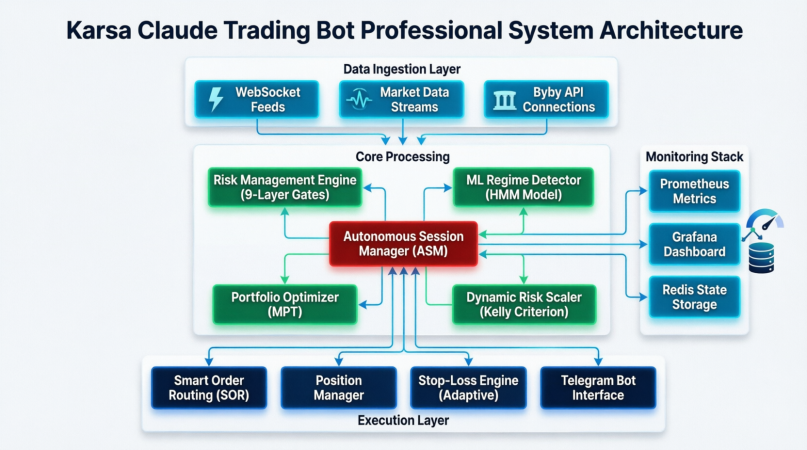

<div align="center">


# Karsa AI Trading System

[](https://www.python.org/downloads/)
[](LICENSE)
[]()
[](https://www.bybit.com/)

**Autonomous Crypto Trading System with Advanced Risk Management & ML-Powered Regime Detection**

[Features](#-features) • [Architecture](#-architecture) • [Quick Start](#-quick-start) • [Commands](#-telegram-commands) • [Monitoring](#-monitoring)

</div>

---

## 📖 Overview

Karsa is an institutional-grade autonomous trading system designed for cryptocurrency perpetual futures markets. Built with a focus on **capital preservation**, **adaptive risk management**, and **intelligent execution**, Karsa combines traditional quantitative strategies with modern machine learning techniques.

### Key Highlights

- 🤖 **Autonomous Session Manager (ASM)** — Self-healing trading sessions with Redis-backed state persistence
- 🧠 **ML-Powered Regime Detection** — Hidden Markov Models for adaptive market state classification
- 🛡️ **9-Layer Risk Management** — Multi-gate validation system protecting against adverse conditions
- 📊 **Portfolio Optimization** — Modern Portfolio Theory (MPT) for correlation-aware position sizing
- ⚡ **Smart Order Routing** — Limit→reprice→market fallback with slippage control
- 📱 **Telegram Control** — Real-time monitoring and one-click position management
- 📈 **Full Observability** — Prometheus metrics + Grafana dashboards

---

## 🏗️ Architecture



```
Telegram Bot ←→ Orchestrator ←→ 9Router (API Gateway) ←→ Anthropic/DeepSeek
                     ↓ dispatches
         IDX Analyst / US Analyst / ETF Analyst / Portfolio Analyst / Crypto Analyst
                     ↓ data from
         TradingView TA (direct Python) + Bybit REST (pybit via WARP proxy) + Redis cache
                     ↓ state in
         PostgreSQL (audit, trades, signals, positions) + Redis (cache, pub/sub, rate limiting, kill switch)
                     ↓ advisory layer
         RegimeFilter (VIX/SPY/IHSG) + CryptoRegime (Hurst+ADX) + PositionSizer (ATR) + StrategySelector
                     ↓ risk gates
         8 crypto risk gates → SOR (limit→reprice→market) → TrailingStop / PositionManager / Reconciler
                     ↓ monitoring
         Prometheus (metrics scrape) → Grafana (dashboards) + Alertmanager (alerts)
```

### System Components

#### Data Ingestion Layer
- **WebSocket Feeds** — Real-time market data streams from Bybit for sub-second stop-loss triggers
- **Bybit REST API** — Order management, position queries, funding rates via WARP SOCKS5 proxy
- **TradingView TA** — Direct Python import for IDX/US/ETF technical indicators with 3-tier fallback

#### Core Processing Engine
- **Autonomous Session Manager (ASM)** — Central orchestrator managing the full trading lifecycle
- **Risk Management Engine** — 9-layer validation gates (funding, volatility, correlation, liquidity)
- **ML Regime Detector** — Hurst Exponent + ADX market state classification (TREND_BULL/BEAR/CHOP/MR)
- **Portfolio Optimizer** — Correlation-tier-aware position sizing with tier-based leverage caps
- **Dynamic Risk Scaler** — Kelly Criterion + volatility targeting

#### Execution Layer
- **Smart Order Routing (SOR)** — Post-only limit orders with 3-attempt reprice, market fallback
- **Position Manager** — Automated partial exits (50% at +1R), trailing stops, time-based closures
- **Adaptive Stop-Loss** — ATR-based stops with regime-aware multipliers
- **Telegram Bot Interface** — Interactive command center with inline keyboards

#### Monitoring Stack
- **Prometheus Metrics** — 40+ real-time performance & health metrics across 6 domains
- **Grafana Dashboard** — Visual monitoring with per-position PnL tables and equity curves
- **Redis State Storage** — Crash-resistant session persistence and circuit breaker state

---

## ✨ Features

### Risk Management

**9-Layer Gate Validation:**

| Gate | Check | Action |
|------|-------|--------|
| 1 | Minimum liquidity threshold | Reject thin markets |
| 2 | Max position size (10% of equity) | Cap exposure |
| 3 | Funding rate projection (>0.05%) | Hard reject crowded trades |
| 4 | Volatility spike detection (5%/15min) | Pause trading |
| 5 | Correlation clustering prevention | 3-tier limits |
| 6 | Daily loss limit (3% kill switch) | Emergency flatten |
| 7 | Circuit breaker activation | Auto-halt |
| 8 | Regime-based size adjustment | 0.5x–1.2x multiplier |
| 9 | Portfolio concentration limits | Cross-market cap |

**Dynamic Position Sizing:**
- Base risk: 1% per trade (configurable)
- Maximum position: 10% of portfolio
- Volatility targeting (15% annualized)
- Tier-based leverage: Tier1 (BTC/ETH) 10x, Tier2 (SOL/AVAX/SUI) 5x, Tier3 (meme/small-cap) 3x

### Trading Strategies

**Regime-Adaptive Logic:**
- **TREND_BULL** — Aggressive sizing (1.2x multiplier)
- **TREND_BEAR** — Defensive positioning (0.5x multiplier)
- **MEAN_REVERSION** — Range-bound strategies (0.8x multiplier)
- **CHOP** — Skip scanning entirely (0.0x)

**Entry/Exit Mechanisms:**
- Confidence-score weighted entries (min 35/100 for aggressive profile)
- Partial profit taking (50% at +1R target)
- Trailing stop-loss (ATR-based, regime-aware multipliers)
- Time-based exits (72h max hold for <1% gain positions)
- ML-based reversal prediction

### Execution Quality

**Smart Order Routing:**
- Post-only limit orders at bid/ask for maker rebates
- 3-attempt reprice loop (30s timeout each)
- Market order fallback for urgent fills
- Stop-loss and take-profit set immediately after fill

**Slippage Control:**
- Real-time orderbook depth analysis via `LiquidityMonitor`
- Pre-trade spread and depth checks ($100k within 0.5%)
- Execution latency tracking (target <100ms)

---

## 🚀 Quick Start

### Prerequisites

```bash
Python 3.11+
Redis 7.0+
Docker & Docker Compose (optional)
Bybit API credentials
```

### Setup

```bash
git clone https://github.com/skeithnight/karsa-claude-trading.git
cd karsa-claude-trading

cp .env.example .env
# Fill in required values:
#   DB_PASSWORD=<12+ chars, no placeholders>
#   REDIS_PASSWORD=<any>
#   TELEGRAM_TOKEN=<from @BotFather>
#   TELEGRAM_CHAT_ID=<your chat ID>
#   9ROUTER_URL, 9ROUTER_AUTH_TOKEN, 9ROUTER_MODEL (or ANTHROPIC_API_KEY)

docker compose up --build
```

### Quick Commands

```bash
# Start all services
docker compose up -d --build

# Rebuild after code changes
docker compose up -d --build karsa-crypto-bot

# Check health
curl http://localhost:8000/health

# View logs
docker logs -f karsa-crypto-bot

# Check ASM status
docker exec karsa-crypto-bot curl -s localhost:8444/metrics | grep auto_session_active
```

---

## 📱 Telegram Commands

### IDX/US/ETF Bot

| Command | Description |
|---------|-------------|
| `/portfolio` | View full portfolio & cash |
| `/add <market> <ticker> <qty> <price>` | Add position |
| `/edit <market> <ticker> qty\|price <value>` | Edit position |
| `/remove <market> <ticker>` | Remove position |
| `/analyze` | AI portfolio analysis |
| `/scan <market> <ticker>` | Quick market readout |
| `/audit <ticker>` | AI reasoning & risk check |
| `/briefing` | Morning dashboard & regime |
| `/regime` | Current market regime (BULL/BEAR/NEUTRAL) |
| `/pnl` | Shadow portfolio performance |
| `/trades` | Paper trading history |
| `/status` | System health & scheduler |
| `/idx` | IDX Intelligence dashboard |
| `/stop` | Activate emergency stop |
| `/resume` | Deactivate emergency stop |

### Crypto Bot

| Command | Description |
|---------|-------------|
| `/start` | Start ASM autonomous trading |
| `/stop` | Stop ASM with MTM PnL report |
| `/status` | Crypto system health & positions |
| `/portfolio` | Open crypto positions with live PnL |
| `/scan` | Trigger manual crypto scan |
| `/pnl` | Detailed PnL breakdown & equity curve |
| `/risk` | Risk dashboard (gates, limits, utilization) |
| `/kill` | Emergency halt — flatten all positions |
| `/sellall` | Close all positions + 15min cooldown |
| `/resume` | Resume after kill/sellall |
| `/activity` | Recent trading activity log |
| `/audit_agent` | Agent performance audit |
| `/guide` | Trading guide & strategy reference |
| `/regime` | Crypto regime (BTC Hurst+ADX) |
| `/funding` | Funding rates across universe |
| `/trades` | Closed trades history |

---

## 📊 Monitoring

### Grafana Dashboard

- **URL**: http://localhost:3000 (admin/admin)
- **Dashboard**: "Karsa ASM & Trading Operations" (`/d/karsa-asm-ops`)
- **Panels**: ASM active state, available cash, realized/unrealized PnL, kill switch status, portfolio equity chart, market regime timeline, open positions table (per-position: ticker, entry/mark price, size, leverage, uPnL with color coding), WS lag, order fill latency, signal rejections
- **Refresh**: 10s auto-refresh

### Prometheus Metrics (port 8444)

| Metric | Description |
|--------|-------------|
| `karsa_auto_session_active` | ASM online/offline |
| `karsa_auto_session_available_cash_usd` | Available USDT balance |
| `karsa_auto_session_realized_pnl_usd` | Session realized PnL |
| `karsa_auto_session_unrealized_pnl_usd` | Total unrealized PnL |
| `karsa_position_unrealized_pnl_usd{ticker,side}` | Per-position PnL |
| `karsa_position_entry_price_usd{ticker}` | Entry price |
| `karsa_position_mark_price_usd{ticker}` | Current mark price |
| `karsa_position_size_qty{ticker}` | Position size in base currency |
| `karsa_position_leverage{ticker}` | Leverage multiplier |
| `karsa_open_positions_count` | Number of open positions |
| `karsa_signal_rejections_total{reason}` | Rejection reasons |
| `karsa_kill_switch_active` | Kill switch state |
| `karsa_circuit_breaker_active` | Circuit breaker state |

### Quick Diagnostics

```bash
# View live positions
docker exec karsa-crypto-bot curl -s localhost:8444/metrics | grep -E "position_|auto_session_"

# Check ASM status
docker exec karsa-crypto-bot curl -s localhost:8444/metrics | grep auto_session_active

# View rejection reasons
docker logs karsa-crypto-bot --tail 100 2>&1 | grep signal_rejected
```

---

## 🔧 Services

| Service | Port | Purpose |
|---------|------|---------|
| `redis` | 6379 | Cache, rate limiting, pub/sub, kill switch |
| `postgres` | 5432 | Audit logs, trades, signals, portfolio state |
| `warp` | 1080 | Cloudflare WARP SOCKS5 proxy for Bybit |
| `karsa-orchestrator` | 8000 | IDX/US/ETF agent scheduler, health + metrics |
| `karsa-crypto-bot` | 8444 | Crypto ASM + Telegram bot, health + metrics |
| `karsa-telegram-bot` | 8443 | IDX/US/ETF HITL approval (polling or webhook) |
| `prometheus` | 9090 | Metrics scraping from orchestrator + crypto-bot |
| `grafana` | 3000 | Dashboards (admin/admin default) |
| `alertmanager` | 9093 | Alert routing |

---

## 🛠️ Development

```bash
# Install dependencies
pip install -e ".[dev]"

# Run tests
pytest

# Run specific test
pytest tests/test_agents/test_idx_analyst.py -v
```

### Key Design Decisions

- **9Router over direct Anthropic** — Secret isolation; agent containers never see API keys
- **Redis pub/sub for HITL** — Decouples Telegram bot from orchestrator
- **APScheduler + MemoryJobStore** — Lightweight scheduling; jobs are stateless scans
- **Idempotency keys on all trades** — Prevents double execution on retries
- **Append-only audit logs** — Every decision logged immutably
- **Crypto auto-execute** — Scan → 9 risk gates → SOR → save → notify (no HITL)
- **Bidirectional reconciliation** — Every 5min, DB ↔ Bybit exchange state drift detection
- **WARP SOCKS5 proxy** — All Bybit API traffic routed through Cloudflare WARP
- **WebSocket-driven stop-loss** — Sub-second SL breach detection bypasses LLM loop
- **Prometheus + Grafana** — 6 metric domains scraped every 15s

---

## 📚 Documentation

- [Crypto Audit](docs/AUDIT_KARSA_CRYPTO_BOT.md) — Post-implementation audit (18 findings, 5 critical)
- [Crypto Design](docs/KARSA_CRYPTO_DESIGN_TEXT.md) — Crypto bot UI design system
- [Review Qwen](docs/AUDIT_REVIEW_QWEN_2JUL.md) — Implementation audit (10 steps, 3 bugs fixed)
- [Review Grok](docs/AUDIT_REVIEW_GROK_2JUL.md) — Implementation audit (6 steps, 1 bug fixed)

---

## License

Private — all rights reserved.
