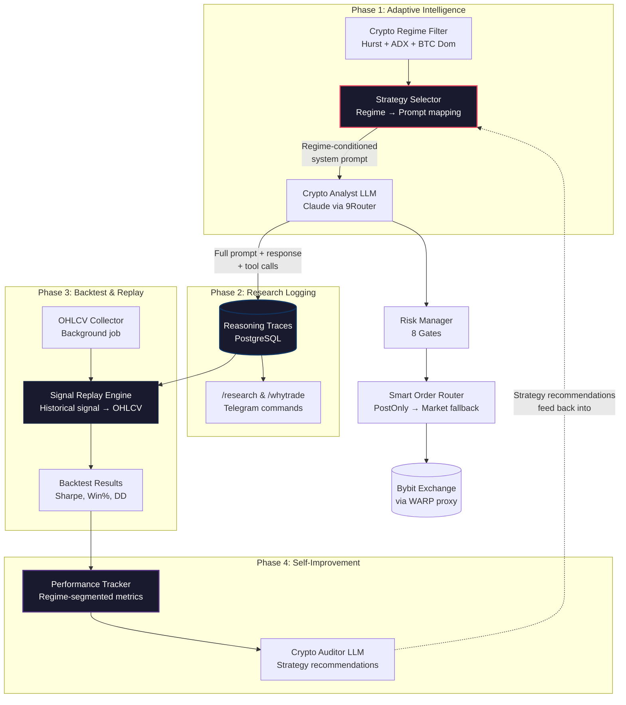

# Dynamic Crypto Research Framework — Implementation Plan

> **Date**: 2026-07-01  
> **Author**: Karsa Development Team  
> **Status**: Draft — Pending Approval  
> **Scope**: Transform Karsa from a rule-bound crypto trading bot into an adaptive, self-improving crypto research framework.

---

## Table of Contents

- [Executive Summary](#executive-summary)
- [Current State Assessment](#current-state-assessment)
- [Gap Analysis](#gap-analysis)
- [Architecture Overview](#architecture-overview)
- [Phase 1: Regime-Adaptive AI Strategy](#phase-1-regime-adaptive-ai-strategy)
- [Phase 2: Structured Reasoning Traces & Research Logging](#phase-2-structured-reasoning-traces--research-logging)
- [Phase 3: Crypto Backtest & Signal Replay Engine](#phase-3-crypto-backtest--signal-replay-engine)
- [Phase 4: Performance Analytics & Self-Improvement Loop](#phase-4-performance-analytics--self-improvement-loop)
- [File Change Summary](#file-change-summary)
- [Open Questions](#open-questions)
- [Verification Plan](#verification-plan)

---

## Executive Summary

The cryptocurrency universe is dynamic, volatile, and operates 24/7. A static trading bot with hardcoded rules will quickly become limited. Karsa already has strong foundations — LLM-powered analysis, parallel scanning, regime detection, and risk management — but several key gaps prevent it from functioning as a true **research framework**.

This plan adds four capabilities:

1. **Regime-Adaptive Strategy** — The AI analyst dynamically adjusts its trading strategy based on market regime instead of using a single hardcoded prompt.
2. **Reasoning Traces** — Every AI decision gets a full audit trail stored in the database, enabling deep research queries like *"Why did the AI short Bitcoin at 2 AM?"*
3. **Signal Replay Backtesting** — Replay historical AI signals against actual price data to measure strategy effectiveness.
4. **Self-Improvement Loop** — Automated performance tracking feeds back into strategy adjustments.

**Total estimated work: ~1,270 lines of production code across 14 files.**

---

## Current State Assessment

| Capability | Status | Evidence |
|---|---|---|
| LLM-powered analysis | ✅ Working | `src/agents/crypto_analyst.py` — Claude via 9Router |
| Parallel scanning | ✅ Working | `src/agents/orchestrator.py` — `asyncio.gather` over 14 pairs |
| Regime filter | ✅ Working | `src/advisory/crypto_regime.py` — Hurst + ADX + BTC dominance |
| Risk management | ✅ Working | `src/risk/crypto_risk_manager.py` — 8 gates |
| Shadow execution | ✅ Working | Paper positions via `src/models/tables.py` |
| Immutable audit | ✅ Working | `AuditLog` + `Signal` + `ClosedPaperTrade` tables |
| HITL Telegram | ✅ Working | `src/bot/crypto_handlers.py` — 17 commands |
| Backtest engine | 🟡 Skeleton | `src/backtest/engine.py` — RSI mean reversion only |

### Crypto Pipeline End-to-End Flow (Current)

```
Scheduler (every hour) or /scan command
  → Orchestrator.scan_all_markets("CRYPTO")
    → Emergency stop gate check
    → CryptoRegimeFilter.get_current_regime()
      → BTC 4H/1D OHLCV → Hurst + ADX → TREND_BULL / TREND_BEAR / MEAN_REVERSION / CHOP
      → CoinGecko BTC dominance → BTC_SEASON / ALT_SEASON / NEUTRAL
    → If CHOP → skip entire scan
    → _scan_crypto_parallel(regime)
      → 14× CryptoAnalyst.run() concurrently via asyncio.gather
        → LLM calls deterministic tools (RSI, BB, MACD, ATR, funding, OI)
        → LLM outputs JSON signal (ticker, direction, confidence, prices, reasoning)
      → Signal deduplication (4h in-memory window)
    → _auto_execute_crypto(signals, regime)
      → For each signal:
        → CryptoRiskManager.evaluate() — 8 risk gates
        → SmartOrderRouter.execute_order() — PostOnly limit → reprice ×3 → market fallback
        → CryptoPosition saved to DB
        → Telegram notification sent
    → _save_signal() for all signals to PostgreSQL
```

---

## Gap Analysis

| Feature | Current State | Gap | Phase |
|---|---|---|---|
| LLM reasoning | ✅ Working via 9Router | Strategy prompt is **static**, not regime-adaptive | 1 |
| Regime filter | ✅ 4-state classification | Not **fed back** into analyst prompt dynamically | 1 |
| Parallel scanning | ✅ `asyncio.gather` | No priority/weighting by regime season | 1 |
| ATR sizing | ✅ Working | Not **regime-adjusted** at prompt level | 1 |
| Audit logs | ✅ PostgreSQL | No structured **reasoning trace** stored | 2 |
| LLM prompt/response | Not persisted | Full prompt + response should be queryable | 2 |
| Paper trading | ✅ Shadow execution | No **backtesting engine** for crypto | 3 |
| Signal replay | ❌ None | Need historical replay of AI signals vs actual prices | 3 |
| OHLCV collection | ✅ Cache table exists | No **background collector** populating it for crypto | 3 |
| Performance analytics | 🟡 Basic audit only | Need Sharpe, drawdown, calibration dashboards | 4 |
| Self-improvement | ❌ None | Auditor findings should feed back into strategy | 4 |
| Dynamic universe | ❌ Static 14 pairs | Could add volume-based rotation (deferred) | Future |
| On-chain data | ❌ None | TVL, DEX volume, whale tracking (deferred) | Future |
| Multi-timeframe | ❌ Single timeframe | 4H + 1D confluence (deferred) | Future |

---

## Architecture Overview



---

## Phase 1: Regime-Adaptive AI Strategy

**Goal**: Make the crypto analyst dynamically adapt its strategy prompt based on the current market regime, instead of using a single hardcoded prompt. This is the single highest-impact change — it transforms the bot from "static rules" to "environment-aware reasoning."

### Why This Matters

Currently, `CryptoAnalyst.SYSTEM_PROMPT` is a single string that says "Trend + Sentiment Convergence" regardless of market conditions. The regime filter exists and correctly classifies TREND_BULL / TREND_BEAR / MEAN_REVERSION / CHOP, but:

- The **CHOP** regime skips the scan entirely (good).
- The **TREND_BEAR** regime still uses the same bullish-leaning prompt (bad).
- The **MEAN_REVERSION** regime still looks for trend signals (bad).
- **BTC_SEASON vs ALT_SEASON** doesn't affect which pairs get priority (missed opportunity).

### Changes

#### `[NEW] src/advisory/strategy_selector.py` (~120 lines)

Deterministic strategy selection — no LLM calls. Pure lookup + interpolation.

```python
class StrategySelector:
    """Maps (regime_state, market_season, ticker_tier) → strategy parameters."""

    REGIME_STRATEGIES = {
        "TREND_BULL": {
            "strategy_name": "Trend Following — Bullish",
            "bias": "LONG",
            "prompt_modifier": """
REGIME CONTEXT: Market is in a CONFIRMED BULLISH TREND (Hurst > 0.5, ADX > 25, BTC > 200 EMA).
STRATEGY ADJUSTMENT:
- Favor LONG setups. Short signals require higher conviction (confidence >= 75).
- Trend continuation > reversal. Look for pullbacks to 20 EMA as entry.
- Full position sizing (regime multiplier: 1.2x).
- Wider stops (2.5x ATR) — let trends breathe.""",
            "confidence_floor": 50,
            "short_confidence_floor": 75,
            "leverage_cap_override": None,
            "size_multiplier": 1.2,
        },
        "TREND_BEAR": {
            "strategy_name": "Trend Following — Bearish",
            "bias": "SHORT",
            "prompt_modifier": """
REGIME CONTEXT: Market is in a CONFIRMED BEARISH TREND (Hurst > 0.5, ADX > 25, BTC < 200 EMA).
STRATEGY ADJUSTMENT:
- Favor SHORT setups. Long signals require extreme conviction (confidence >= 80).
- Don't catch falling knives. Only long on clear reversal patterns with volume.
- Reduced position sizing (regime multiplier: 0.5x).
- Tight stops (1.5x ATR) — protect capital in downtrends.""",
            "confidence_floor": 50,
            "short_confidence_floor": 50,
            "leverage_cap_override": 3,
            "size_multiplier": 0.5,
        },
        "MEAN_REVERSION": {
            "strategy_name": "Mean Reversion",
            "bias": "NEUTRAL",
            "prompt_modifier": """
REGIME CONTEXT: Market is MEAN-REVERTING (Hurst < 0.45). Prices tend to revert to the mean.
STRATEGY ADJUSTMENT:
- Fade extremes. Buy RSI < 30 + below lower BB. Short RSI > 70 + above upper BB.
- DO NOT chase trends — they will reverse.
- Smaller positions (regime multiplier: 0.8x).
- Tight take-profits (2:1 R/R instead of 3:1) — mean reversion moves are shorter.""",
            "confidence_floor": 55,
            "short_confidence_floor": 55,
            "leverage_cap_override": 3,
            "size_multiplier": 0.8,
        },
        "CHOP": {
            "strategy_name": "Ultra-Conservative / Skip",
            "bias": "NEUTRAL",
            "prompt_modifier": """
REGIME CONTEXT: Market is CHOPPY (ADX < 20). No clear trend. High whipsaw risk.
STRATEGY ADJUSTMENT:
- EXTREME CAUTION. Only trade if all indicators are perfectly aligned.
- Minimum confidence: 80.
- Half position sizing (regime multiplier: 0.5x).
- Tighter stops (1x ATR). Quick exits.""",
            "confidence_floor": 80,
            "short_confidence_floor": 80,
            "leverage_cap_override": 2,
            "size_multiplier": 0.5,
        },
    }

    SEASON_MODIFIERS = {
        "BTC_SEASON": "BTC DOMINANCE > 55% — favor BTC/ETH (Tier 1). Reduce alt exposure.",
        "ALT_SEASON": "BTC DOMINANCE < 45% — alts outperforming. Spread across Tier 2/3.",
        "NEUTRAL": "BTC dominance neutral. No season bias.",
    }

    @classmethod
    def get_strategy(cls, regime_state: str, market_season: str, ticker: str) -> dict:
        """Return strategy parameters for the given context."""
        ...

    @classmethod
    def build_regime_prompt(cls, regime: dict) -> str:
        """Build the regime-conditioned prompt modifier string."""
        ...
```

#### `[MODIFY] src/agents/crypto_analyst.py` (~80 lines changed)

Replace the single hardcoded `SYSTEM_PROMPT` with a dynamic prompt builder:

```python
class CryptoAnalyst(BaseAgent):
    # Remove: SYSTEM_PROMPT = "..." (static)
    # Add: dynamic prompt construction

    BASE_SYSTEM_PROMPT = """You are the Crypto Analyst Agent for the Karsa Trading System.
Analyze cryptocurrency perpetual contracts on Bybit.
...core rules that never change (output format, tool descriptions, etc.)..."""

    def __init__(self, mcp, rate_limiter=None, regime=None):
        self._regime = regime
        system_prompt = self._build_regime_prompt(regime)
        super().__init__(
            name="crypto_analyst",
            combo_name="karsa-routine",
            system_prompt=system_prompt,
            tools=self.TOOLS,
            mcp=mcp,
            rate_limiter=rate_limiter,
        )

    def update_regime(self, regime: dict):
        """Update regime context for next analysis cycle."""
        self._regime = regime
        self.system_prompt = self._build_regime_prompt(regime)

    def _build_regime_prompt(self, regime: dict | None) -> str:
        """Construct system prompt with regime-specific strategy injection."""
        from src.advisory.strategy_selector import StrategySelector
        if not regime:
            return self.BASE_SYSTEM_PROMPT
        modifier = StrategySelector.build_regime_prompt(regime)
        return f"{self.BASE_SYSTEM_PROMPT}\n\n{modifier}"
```

#### `[MODIFY] src/agents/orchestrator.py` (~30 lines changed)

Pass regime to crypto analyst before scanning:

```python
# In _scan_crypto_parallel:
self.crypto_agent.update_regime(regime)  # Inject regime into prompt

# In _scan_market for CRYPTO:
# Replace generic context_hint with regime-aware context from StrategySelector
```

---

## Phase 2: Structured Reasoning Traces & Research Logging

**Goal**: Every AI decision gets a full reasoning trace stored in the database, making the system a true research tool where you can query "why did the AI do X?"

### Why This Matters

Currently, the `Signal.reasoning` field is a single text blob. There's no way to query:
- What prompt was the AI given?
- What tool calls did the AI make, and what data did it see?
- What was the regime state at decision time?
- How did the AI's confidence relate to the indicators?

### Changes

#### `[MODIFY] src/models/tables.py` (~30 lines added)

New table `ReasoningTrace`:

```python
class ReasoningTrace(Base):
    """Full reasoning trace for every AI trading decision."""
    __tablename__ = "reasoning_traces"

    id: Mapped[uuid.UUID] = mapped_column(UUID(as_uuid=True), primary_key=True, default=uuid.uuid4)
    signal_id: Mapped[uuid.UUID | None] = mapped_column(UUID(as_uuid=True), ForeignKey("signals.id"))
    ticker: Mapped[str] = mapped_column(String(20), nullable=False)
    market: Mapped[str] = mapped_column(String(10), nullable=False)

    # Context at decision time
    regime_state: Mapped[str | None] = mapped_column(String(20))
    regime_data: Mapped[dict | None] = mapped_column(JSON)
    indicators_snapshot: Mapped[dict | None] = mapped_column(JSON)

    # LLM interaction
    system_prompt: Mapped[str | None] = mapped_column(Text)
    user_prompt: Mapped[str | None] = mapped_column(Text)
    tool_calls: Mapped[dict | None] = mapped_column(JSON)  # [{name, input, output}, ...]
    llm_response_raw: Mapped[str | None] = mapped_column(Text)

    # Decision
    direction: Mapped[str | None] = mapped_column(String(10))
    confidence_score: Mapped[int | None] = mapped_column(Integer)
    decision_reasoning: Mapped[str | None] = mapped_column(Text)

    created_at: Mapped[datetime] = mapped_column(DateTime, default=datetime.utcnow)
```

#### `[MODIFY] src/agents/base.py` (~50 lines added)

Capture the full LLM conversation during `agent.run()`:

```python
class BaseAgent:
    async def run(self, user_prompt: str) -> dict:
        # ... existing logic ...
        # NEW: Collect all tool calls and responses
        self._last_trace = {
            "system_prompt": self.system_prompt,
            "user_prompt": user_prompt,
            "tool_calls": [],  # populated during tool-use loop
            "llm_response_raw": None,  # set after final response
        }
        # ... tool-use loop appends to self._last_trace["tool_calls"] ...
        return result

    def get_last_trace(self) -> dict | None:
        """Return the reasoning trace from the last run() call."""
        return getattr(self, "_last_trace", None)
```

#### `[MODIFY] src/agents/orchestrator.py` (~20 lines added)

After each crypto analysis, save the reasoning trace:

```python
# In _scan_crypto_parallel, after agent.run():
trace = self.crypto_agent.get_last_trace()
if trace:
    await self._save_reasoning_trace(signal, trace, regime)
```

#### `[NEW] src/bot/research_commands.py` (~150 lines)

New Telegram research commands:

| Command | Purpose |
|---------|---------|
| `/research <ticker>` | Last 5 reasoning traces for a ticker. Shows regime, confidence, indicators, and decision. |
| `/whytrade <signal_id>` | Deep dive into a single signal's full reasoning trace — the exact prompt, tool calls, and LLM response. |
| `/compare <ticker> <days>` | Compare AI decisions across different regime states for the same ticker. |

#### `[NEW] Alembic migration` (~40 lines)

Database migration to add the `reasoning_traces` table.

```sql
CREATE TABLE reasoning_traces (
    id UUID PRIMARY KEY DEFAULT gen_random_uuid(),
    signal_id UUID REFERENCES signals(id),
    ticker VARCHAR(20) NOT NULL,
    market VARCHAR(10) NOT NULL,
    regime_state VARCHAR(20),
    regime_data JSONB,
    indicators_snapshot JSONB,
    system_prompt TEXT,
    user_prompt TEXT,
    tool_calls JSONB,
    llm_response_raw TEXT,
    direction VARCHAR(10),
    confidence_score INTEGER,
    decision_reasoning TEXT,
    created_at TIMESTAMP DEFAULT now()
);

CREATE INDEX idx_traces_ticker ON reasoning_traces(ticker);
CREATE INDEX idx_traces_regime ON reasoning_traces(regime_state);
CREATE INDEX idx_traces_created ON reasoning_traces(created_at);

-- Immutable: no updates or deletes
CREATE RULE no_update_traces AS ON UPDATE TO reasoning_traces DO INSTEAD NOTHING;
CREATE RULE no_delete_traces AS ON DELETE TO reasoning_traces DO INSTEAD NOTHING;
```

---

## Phase 3: Crypto Backtest & Signal Replay Engine

**Goal**: Replay historical signals against actual price data to measure strategy effectiveness. Not a traditional backtest — it replays *AI decisions* to validate the research.

### Why This Matters

The existing `src/backtest/engine.py` only supports RSI mean reversion for traditional markets. There is no way to:
- Replay the AI's historical crypto signals against actual price data
- Measure if the Trend + Sentiment strategy actually works
- Compare performance across different regime states
- Validate that regime-adaptive prompts (Phase 1) improve results

### Changes

#### `[MODIFY] src/backtest/engine.py` (~100 lines added)

Add crypto-specific backtest strategy:

```python
def backtest_crypto_trend_sentiment(
    candles: list[dict], ticker: str,
    funding_data: list[dict] | None = None,
) -> BacktestResult:
    """Trend + Sentiment Convergence backtest.

    Entry: Price > 20 EMA > 50 EMA + negative funding + volume > 1.5x avg.
    Exit: Close below 20 EMA or 3:1 R/R.
    Includes funding cost calculation.
    """
    ...
```

#### `[NEW] src/backtest/signal_replay.py` (~200 lines)

Replay historical AI signals from the database:

```python
class SignalReplayEngine:
    """Replays historical Signal records against actual OHLCV data."""

    async def replay(
        self,
        start_date: datetime,
        end_date: datetime,
        market: str = "CRYPTO",
        ticker: str | None = None,
        regime_filter: str | None = None,
    ) -> ReplayResult:
        """
        1. Query Signal table for matching signals
        2. For each signal, load OHLCV data from ohlcv_cache
        3. Simulate entry at signal's entry_price
        4. Check if target_price or stop_loss_price was hit first
        5. Calculate theoretical PnL including funding costs
        6. Aggregate into regime-segmented results
        """
        ...

class ReplayResult:
    total_signals: int
    executed_signals: int
    win_rate: float
    total_pnl_pct: float
    sharpe_ratio: float
    max_drawdown_pct: float
    avg_hold_duration_hours: float
    funding_cost_total_pct: float
    by_regime: dict[str, dict]  # Per-regime breakdown
    by_ticker: dict[str, dict]  # Per-ticker breakdown
    by_direction: dict[str, dict]  # LONG vs SHORT
```

#### `[NEW] src/backtest/ohlcv_collector.py` (~80 lines)

Background job to populate the `ohlcv_cache` table for backtesting:

```python
class OHLCVCollector:
    """Background job to fetch and cache OHLCV data for all crypto pairs."""

    async def collect(self, timeframes: list[str] = ["4h", "1D"]):
        """Fetch latest OHLCV for all CRYPTO_UNIVERSE pairs and persist to ohlcv_cache."""
        for symbol in CRYPTO_UNIVERSE:
            for tf in timeframes:
                candles = await self.bybit.get_ohlcv(symbol, timeframe=tf, limit=200)
                await self._upsert_candles(symbol, "CRYPTO", tf, candles)
```

Register as scheduled job in `src/main.py`:

```python
scheduler.add_job(
    self._job_collect_ohlcv, "cron",
    hour="*/4",  # Every 4 hours
    id="collect_crypto_ohlcv",
)
```

#### Telegram commands (added to `src/bot/crypto_handlers.py`)

| Command | Purpose |
|---------|---------|
| `/backtest <ticker> [days]` | Run the Trend + Sentiment backtest on a ticker's cached OHLCV data. |
| `/replay [days]` | Replay last N days of AI signals and show aggregated performance. |

---

## Phase 4: Performance Analytics & Self-Improvement Loop

**Goal**: Automated performance tracking, dashboards, and a feedback loop where the system's audit findings inform strategy adjustments.

### Why This Matters

The current audit system (`crypto_audit.py` + `crypto_auditor.py`) computes basic metrics and generates LLM recommendations, but:
- Metrics are not segmented by regime state
- There's no confidence calibration (are 80% confidence signals actually better than 60%?)
- Auditor recommendations are shown to the user but never fed back into the system
- No equity curve or drawdown tracking over time

### Changes

#### `[MODIFY] src/advisory/crypto_audit.py` (~80 lines added)

Expand `CryptoAuditMetrics.gather()` with research-grade analytics:

```python
class CryptoAuditMetrics:
    @staticmethod
    async def gather(days: int = 7) -> dict:
        # ... existing metrics ...
        # NEW:
        metrics["regime_performance"] = await cls._regime_segmented_performance(session, since)
        metrics["confidence_calibration"] = await cls._confidence_calibration(session, since)
        metrics["time_of_day_analysis"] = await cls._time_of_day_analysis(session, since)
        metrics["correlation_analysis"] = await cls._correlation_analysis(session, since)
        return metrics

    @staticmethod
    async def _regime_segmented_performance(session, since):
        """Win rate, avg PnL, Sharpe per regime state at time of signal."""
        # JOIN signals → reasoning_traces → closed_paper_trades
        # GROUP BY regime_state
        ...

    @staticmethod
    async def _confidence_calibration(session, since):
        """Bucket signals by confidence (50-60, 60-70, 70-80, 80-90, 90-100).
        For each bucket: count, actual win rate, avg PnL.
        Ideal: win rate should increase with confidence."""
        ...
```

#### `[NEW] src/advisory/performance_tracker.py` (~150 lines)

Persistent performance tracking:

```python
class PerformanceTracker:
    """Tracks and queries crypto trading performance over time."""

    async def daily_snapshot(self):
        """Save daily equity snapshot to crypto_pnl_snapshots table."""
        ...

    async def get_equity_curve(self, days: int = 30) -> list[dict]:
        """Returns [{date, equity, drawdown_pct, open_positions}, ...]"""
        ...

    async def get_regime_performance(self, days: int = 30) -> dict:
        """Performance breakdown by regime state."""
        ...

    async def get_confidence_calibration(self, days: int = 30) -> list[dict]:
        """Returns [{bucket: '70-80', signals: 15, win_rate: 0.67, avg_pnl: 1.2}, ...]"""
        ...

    async def get_summary(self, days: int = 7) -> dict:
        """Single-call dashboard: win rate, PnL, Sharpe, max DD, best/worst."""
        ...
```

#### `[MODIFY] src/agents/crypto_auditor.py` (~60 lines changed)

Enhance the auditor to produce actionable strategy recommendations:

```python
class CryptoAuditorAgent(BaseAgent):
    SYSTEM_PROMPT = """...
    You MUST output concrete strategy modifications, not just observations:
    - If TREND_BEAR win rate < 40%, recommend tighter entry criteria
    - If confidence calibration shows 60% signals outperform 80%, recommend recalibrating
    - If a specific ticker consistently loses, recommend removing from universe
    ...
    Output a "strategy_adjustments" field with machine-readable modifications.
    """
```

#### `[NEW] src/models/tables.py` — `StrategyRecommendation` table

```python
class StrategyRecommendation(Base):
    """Auditor-generated strategy recommendations (tracked over time)."""
    __tablename__ = "strategy_recommendations"

    id: Mapped[int] = mapped_column(BigInteger, primary_key=True, autoincrement=True)
    audit_date: Mapped[datetime] = mapped_column(DateTime, nullable=False)
    regime_state: Mapped[str | None] = mapped_column(String(20))
    recommendation_type: Mapped[str] = mapped_column(String(50))  # confidence_adjustment, universe_change, etc.
    recommendation: Mapped[dict] = mapped_column(JSON)
    applied: Mapped[bool] = mapped_column(default=False)
    created_at: Mapped[datetime] = mapped_column(DateTime, default=datetime.utcnow)
```

#### Telegram analytics commands (added to `src/bot/crypto_handlers.py`)

| Command | Purpose |
|---------|---------|
| `/stats [days]` | Performance dashboard: win rate, total PnL, Sharpe, max drawdown, trade count. |
| `/equity [days]` | Equity curve as formatted text table. |
| `/calibration` | Confidence calibration report — are high-confidence signals actually better? |
| `/regimestats` | Per-regime performance breakdown — which regime produces the best trades? |

---

## File Change Summary

| Phase | File | Action | LOC Est. |
|---|---|---|---|
| **1** | `src/advisory/strategy_selector.py` | **NEW** | ~120 |
| **1** | `src/agents/crypto_analyst.py` | MODIFY | ~80 |
| **1** | `src/agents/orchestrator.py` | MODIFY | ~30 |
| **2** | `src/models/tables.py` | MODIFY | ~30 |
| **2** | `src/agents/base.py` | MODIFY | ~50 |
| **2** | `src/bot/research_commands.py` | **NEW** | ~150 |
| **2** | `db/migrations/add_reasoning_traces.sql` | **NEW** | ~40 |
| **3** | `src/backtest/engine.py` | MODIFY | ~100 |
| **3** | `src/backtest/signal_replay.py` | **NEW** | ~200 |
| **3** | `src/backtest/ohlcv_collector.py` | **NEW** | ~80 |
| **4** | `src/advisory/crypto_audit.py` | MODIFY | ~80 |
| **4** | `src/advisory/performance_tracker.py` | **NEW** | ~150 |
| **4** | `src/agents/crypto_auditor.py` | MODIFY | ~60 |
| **4** | `src/bot/crypto_handlers.py` | MODIFY | ~100 |
| | | **TOTAL** | **~1,270** |

---

## Open Questions

> **Q1: Backtesting Approach**  
> Should the signal replay engine replay *historical LLM signals* from the database (testing if the AI's past decisions were profitable), or build a traditional indicator-based backtest for the Trend + Sentiment strategy? **Recommendation**: Do both — the indicator backtest validates the strategy logic, the signal replay validates the AI's interpretation of that strategy.

> **Q2: On-Chain Data Priority**  
> Adding on-chain data (TVL, DEX volume, whale tracking) requires external APIs (DeFiLlama, Dune, etc.). Should this be included now or deferred? **Recommendation**: Defer to Phase 5 after the core research loop is proven.

> **Q3: Dynamic Universe Expansion**  
> Should the system automatically add/remove pairs based on volume/momentum, or keep a curated universe configurable via Telegram? **Recommendation**: Start with Telegram-configurable universe (`/addpair`, `/removepair`) before full automation.

> **Q4: Performance Dashboard Format**  
> For Telegram analytics, should we generate chart images (matplotlib → PNG) or text-based tables? **Recommendation**: Start with text tables (faster, no dependency), add chart images as a follow-up.

---

## Verification Plan

### Automated Tests

```bash
# Phase 1: Strategy selector
pytest tests/test_strategy_selector.py -v

# Phase 2: Reasoning traces
pytest tests/test_reasoning_trace.py -v

# Phase 3: Signal replay & backtest
pytest tests/test_signal_replay.py -v
pytest tests/test_backtest_crypto.py -v

# Phase 4: Performance tracker
pytest tests/test_performance_tracker.py -v

# Integration: full crypto pipeline with regime injection
pytest tests/test_crypto_pipeline_integration.py -v
```

### Manual Verification

1. Run a crypto scan with `TRADING_MODE=paper` and verify:
   - Regime state is injected into the analyst's system prompt
   - Reasoning trace is saved to `reasoning_traces` table
   - Signal is persisted with correct regime metadata

2. Telegram command verification:
   - `/research BTCUSDT` → shows last 5 reasoning traces
   - `/whytrade <uuid>` → shows full prompt + response
   - `/backtest BTCUSDT 30` → runs backtest and shows results
   - `/stats 7` → shows 7-day performance dashboard

3. Self-improvement loop:
   - Run `/audit_agent` → verify regime-segmented metrics in output
   - Verify `strategy_recommendations` table gets populated

### Database Verification

```sql
-- Phase 2: Verify reasoning traces are populated
SELECT COUNT(*), regime_state
FROM reasoning_traces
GROUP BY regime_state;

-- Phase 3: Verify OHLCV collector is filling cache
SELECT ticker, timeframe, COUNT(*) AS candles, MAX(timestamp) AS latest
FROM ohlcv_cache
WHERE market = 'CRYPTO'
GROUP BY ticker, timeframe;

-- Phase 4: Confidence calibration query
SELECT
    (confidence_score / 10) * 10 AS bucket,
    COUNT(*) AS signals,
    ROUND(AVG(CASE WHEN c.realized_pnl_pct > 0 THEN 1.0 ELSE 0.0 END), 2) AS win_rate,
    ROUND(AVG(c.realized_pnl_pct), 2) AS avg_pnl
FROM signals s
JOIN closed_paper_trades c ON s.id = c.signal_id
WHERE s.market = 'CRYPTO'
GROUP BY bucket
ORDER BY bucket;
```

---

## Execution Order

Each phase is independently deployable but builds on previous phases:

```
Phase 1 (Regime-Adaptive Strategy)
  └── Phase 2 (Reasoning Traces)           ← needs Phase 1's regime data in traces
        └── Phase 3 (Signal Replay)         ← needs Phase 2's traces for replay
              └── Phase 4 (Self-Improvement) ← needs Phase 3's replay results for feedback
```

**Recommended timeline**:
- **Phase 1**: 1-2 days (highest impact, smallest change)
- **Phase 2**: 2-3 days (DB migration + trace capture + Telegram commands)
- **Phase 3**: 2-3 days (OHLCV collector + replay engine + backtest strategy)
- **Phase 4**: 2-3 days (analytics + auditor enhancement + Telegram dashboard)

**Total: ~8-10 days of focused development.**
