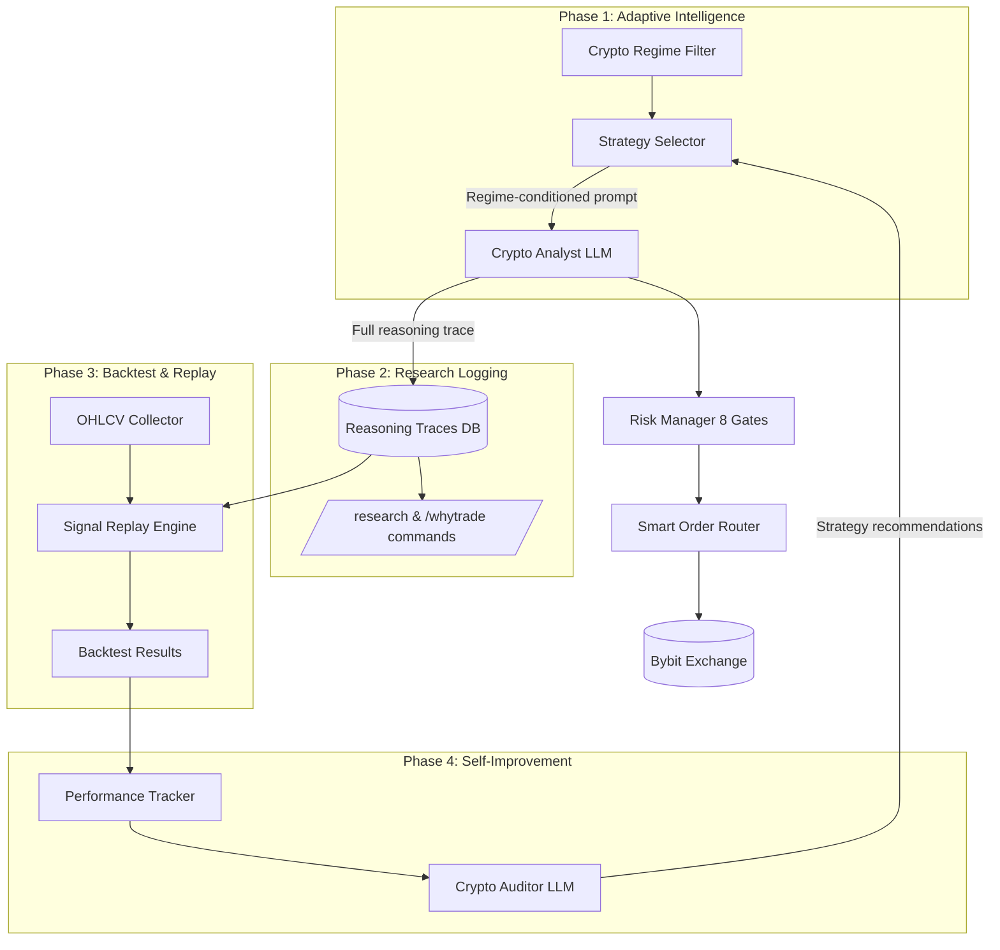

# Dynamic Crypto Research Framework — Implementation Plan

Transform Karsa from a rule-bound crypto trading bot into an adaptive, self-improving crypto research framework that observes, adapts, logs reasoning traces, and tests hypotheses in real-time.

## Current State Assessment

The codebase already has strong foundations:

| Capability | Status | Evidence |
|---|---|---|
| LLM-powered analysis | ✅ Working | [crypto_analyst.py](file:///Users/dwiki.nugraha/dwikicode/karsa-claude-trading/src/agents/crypto_analyst.py) — Claude via 9Router |
| Parallel scanning | ✅ Working | [orchestrator.py](file:///Users/dwiki.nugraha/dwikicode/karsa-claude-trading/src/agents/orchestrator.py#L263-L305) — `asyncio.gather` over 14 pairs |
| Regime filter | ✅ Working | [crypto_regime.py](file:///Users/dwiki.nugraha/dwikicode/karsa-claude-trading/src/advisory/crypto_regime.py) — Hurst + ADX + BTC dominance |
| Risk management | ✅ Working | [crypto_risk_manager.py](file:///Users/dwiki.nugraha/dwikicode/karsa-claude-trading/src/risk/crypto_risk_manager.py) — 8 gates |
| Shadow execution | ✅ Working | Paper positions via [tables.py](file:///Users/dwiki.nugraha/dwikicode/karsa-claude-trading/src/models/tables.py) |
| Immutable audit | ✅ Working | `AuditLog` + `Signal` + `ClosedPaperTrade` tables |
| HITL Telegram | ✅ Working | [crypto_handlers.py](file:///Users/dwiki.nugraha/dwikicode/karsa-claude-trading/src/bot/crypto_handlers.py) |
| Backtest engine | 🟡 Skeleton | [engine.py](file:///Users/dwiki.nugraha/dwikicode/karsa-claude-trading/src/backtest/engine.py) — RSI mean reversion only |

---

## Open Questions

> [!IMPORTANT]
> **Q1: Backtesting Scope** — The existing backtest engine only supports RSI mean reversion. Should we extend it to replay *historical LLM signals* from the database (testing if the AI's past decisions were profitable), or build a traditional indicator-based backtest for the Trend + Sentiment strategy?

> [!IMPORTANT]
> **Q2: On-Chain Data Priority** — Adding on-chain data (TVL, DEX volume, whale tracking) requires external APIs (DeFiLlama, Dune, etc.). Should we prioritize this in Phase 1, or defer to Phase 2 after the core research loop is solid?

> [!IMPORTANT]
> **Q3: Dynamic Universe Expansion** — Should the system automatically add/remove pairs based on volume/momentum (e.g., "scan top 30 by volume on Bybit, pick top 15"), or should we keep a curated universe but make it configurable via Telegram commands?

> [!IMPORTANT]
> **Q4: Performance Dashboard** — For the Telegram analytics dashboard, should we generate chart images (matplotlib/plotly → PNG → send) or keep it text-based with formatted tables?

---

## Proposed Changes

Changes are organized into **4 phases**, each independently deployable. Each phase builds on the previous but can be shipped alone.

---

### Phase 1: Regime-Adaptive AI Strategy (Core Intelligence Loop)

**Goal**: Make the crypto analyst dynamically adapt its strategy prompt based on the current market regime, instead of using a single hardcoded prompt. This is the single highest-impact change — it transforms the bot from "static rules" to "environment-aware reasoning."

#### [MODIFY] [crypto_analyst.py](file:///Users/dwiki.nugraha/dwikicode/karsa-claude-trading/src/agents/crypto_analyst.py)
- Replace single `SYSTEM_PROMPT` with a **regime-conditioned prompt builder**
- Add `REGIME_PROMPTS` dict mapping each regime state to strategy adjustments:
  - `TREND_BULL` → Full trend-following, long bias, higher confidence thresholds
  - `TREND_BEAR` → Short bias, tighter stops, lower leverage cap
  - `MEAN_REVERSION` → Fade extremes, RSI/BB focus, smaller positions
  - `CHOP` → Skip or ultra-conservative scalps only
- Add `market_season` conditioning (BTC season vs alt season) to universe weighting
- Accept `regime: dict` parameter in `analyze()` and inject into prompt dynamically

#### [MODIFY] [orchestrator.py](file:///Users/dwiki.nugraha/dwikicode/karsa-claude-trading/src/agents/orchestrator.py)
- Pass full `crypto_regime` dict to `_scan_market()` for crypto
- Currently passes `composite=regime` but the crypto analyst's `SYSTEM_PROMPT` doesn't consume it dynamically — fix this gap
- Add regime context injection into the per-ticker prompt (not just a generic context hint)

#### [NEW] `src/advisory/strategy_selector.py`
- `StrategySelector` class that maps `(regime_state, market_season, ticker_tier)` → strategy parameters
- Returns: prompt modifications, confidence adjustments, leverage caps, position sizing multipliers
- Deterministic — no LLM calls. Pure lookup + interpolation.

---

### Phase 2: Structured Reasoning Traces & Research Logging

**Goal**: Every AI decision gets a full reasoning trace stored in the database, making the system a true research tool where you can query "why did the AI do X?"

#### [NEW] `src/models/reasoning_trace.py`
Add new table `ReasoningTrace`:
```python
class ReasoningTrace(Base):
    __tablename__ = "reasoning_traces"
    id: UUID (PK)
    signal_id: FK → signals.id
    ticker: str
    regime_state: str  # TREND_BULL, etc.
    regime_data: JSON  # Full regime snapshot
    indicators_snapshot: JSON  # All TA values at decision time
    prompt_sent: Text  # Exact system + user prompt
    llm_response_raw: Text  # Raw LLM output
    tool_calls: JSON  # Which tools the LLM called and results
    confidence_reasoning: Text  # Why this confidence score
    decision: str  # LONG/SHORT/SKIP
    created_at: DateTime
```

#### [MODIFY] [tables.py](file:///Users/dwiki.nugraha/dwikicode/karsa-claude-trading/src/models/tables.py)
- Add `ReasoningTrace` model
- Update `AuditLog` component constraint to include `'REASONING_TRACE'`
- Add Alembic migration

#### [MODIFY] [base.py](file:///Users/dwiki.nugraha/dwikicode/karsa-claude-trading/src/agents/base.py)
- Add `_save_reasoning_trace()` method to `BaseAgent`
- Capture full LLM conversation (prompts + tool calls + responses) during `agent.run()`
- Store in `ReasoningTrace` after each analysis

#### [NEW] `src/bot/research_commands.py`
- `/research <ticker>` — Query reasoning traces for a specific ticker. Shows last 5 decisions with confidence, regime, and key indicators.
- `/whytrade <signal_id>` — Deep dive into a single trade's reasoning trace
- `/compare <ticker> <days>` — Compare AI decisions across different regime states

---

### Phase 3: Crypto Backtest & Signal Replay Engine

**Goal**: Replay historical signals against actual price data to measure strategy effectiveness. Not a traditional backtest — it replays *AI decisions* to validate the research.

#### [MODIFY] [engine.py](file:///Users/dwiki.nugraha/dwikicode/karsa-claude-trading/src/backtest/engine.py)
- Add `backtest_crypto_trend_sentiment()` — implements the Trend + Sentiment Convergence strategy deterministically
- Add `replay_historical_signals()` — takes historical `Signal` records, applies them to actual OHLCV data, computes theoretical PnL
- Add `CryptoBacktestResult` with crypto-specific metrics: funding cost impact, max leverage used, regime-adjusted returns

#### [NEW] `src/backtest/signal_replay.py`
- `SignalReplayEngine` class
  - `replay(start_date, end_date, filters)` → Replays all saved signals from DB
  - Applies actual OHLCV data from `ohlcv_cache` table
  - Computes: win rate, Sharpe, max drawdown, funding costs, regime-segmented returns
  - Outputs `ReplayResult` with per-signal and aggregate metrics

#### [NEW] `src/backtest/ohlcv_collector.py`
- Background job to periodically fetch and cache OHLCV data for all crypto universe pairs
- Fills `ohlcv_cache` table for backtesting use
- Supports multiple timeframes (4h, 1D)

#### [MODIFY] Telegram bot — add commands:
- `/backtest <strategy> <ticker> [days]` — Run backtest on a ticker
- `/replay [days]` — Replay last N days of AI signals and show performance

---

### Phase 4: Performance Analytics & Self-Improvement Loop

**Goal**: Automated performance tracking, dashboards, and a feedback loop where the system's audit findings inform strategy adjustments.

#### [MODIFY] [crypto_audit.py](file:///Users/dwiki.nugraha/dwikicode/karsa-claude-trading/src/advisory/crypto_audit.py)
- Add regime-segmented performance metrics (win rate per regime state)
- Add confidence calibration curve (are 80% confidence signals actually better than 60%?)
- Add time-of-day analysis (which hours produce best signals?)
- Add correlation analysis (do signals cluster or diversify?)

#### [NEW] `src/advisory/performance_tracker.py`
- `PerformanceTracker` class
  - `daily_snapshot()` — Saves daily PnL, equity curve, max drawdown to `crypto_pnl_snapshots`
  - `get_equity_curve(days)` — Returns equity curve data
  - `get_regime_performance()` — Performance breakdown by regime state
  - `get_confidence_calibration()` — Confidence vs actual win rate

#### [MODIFY] [crypto_auditor.py](file:///Users/dwiki.nugraha/dwikicode/karsa-claude-trading/src/agents/crypto_auditor.py)
- Feed regime-segmented metrics into the LLM auditor
- Have the auditor output *concrete strategy modifications* (not just observations)
- Store auditor recommendations in a new `StrategyRecommendation` table
- Orchestrator can optionally apply recommendations to prompt adjustments

#### Telegram analytics commands:
- `/stats [days]` — Performance dashboard (win rate, PnL, Sharpe, drawdown)
- `/equity [days]` — Equity curve as text-based chart
- `/calibration` — Confidence calibration report
- `/regimestats` — Per-regime performance breakdown

---

## File Change Summary

| Phase | File | Action | LOC Estimate |
|---|---|---|---|
| 1 | `src/agents/crypto_analyst.py` | MODIFY | ~80 lines |
| 1 | `src/agents/orchestrator.py` | MODIFY | ~30 lines |
| 1 | `src/advisory/strategy_selector.py` | NEW | ~120 lines |
| 2 | `src/models/tables.py` | MODIFY | ~30 lines |
| 2 | `src/agents/base.py` | MODIFY | ~50 lines |
| 2 | `src/bot/research_commands.py` | NEW | ~150 lines |
| 2 | Alembic migration | NEW | ~40 lines |
| 3 | `src/backtest/engine.py` | MODIFY | ~100 lines |
| 3 | `src/backtest/signal_replay.py` | NEW | ~200 lines |
| 3 | `src/backtest/ohlcv_collector.py` | NEW | ~80 lines |
| 4 | `src/advisory/crypto_audit.py` | MODIFY | ~80 lines |
| 4 | `src/advisory/performance_tracker.py` | NEW | ~150 lines |
| 4 | `src/agents/crypto_auditor.py` | MODIFY | ~60 lines |
| 4 | Telegram commands | MODIFY | ~100 lines |

**Total estimated: ~1,270 lines of production code across 4 phases.**

---

## Verification Plan

### Automated Tests
```bash
# Unit tests for each new module
pytest tests/test_strategy_selector.py -v
pytest tests/test_reasoning_trace.py -v
pytest tests/test_signal_replay.py -v
pytest tests/test_performance_tracker.py -v

# Integration test: full crypto scan with regime injection
pytest tests/test_crypto_pipeline_integration.py -v

# Backtest validation
pytest tests/test_backtest_crypto.py -v
```

### Manual Verification
- Run a crypto scan with `TRADING_MODE=paper` and verify:
  - Regime state is injected into the analyst prompt
  - Reasoning trace is saved to `reasoning_traces` table
  - Audit log captures the full decision chain
- Trigger `/research BTCUSDT` in Telegram and verify trace output
- Run `/backtest trend_sentiment BTCUSDT 30` and verify results
- Run `/stats 7` and verify performance dashboard

### Database Verification
```sql
-- Verify reasoning traces are being saved
SELECT COUNT(*), regime_state FROM reasoning_traces GROUP BY regime_state;

-- Verify confidence calibration data
SELECT confidence_score / 10 * 10 AS bucket,
       COUNT(*) AS signals,
       AVG(CASE WHEN realized_pnl_pct > 0 THEN 1.0 ELSE 0.0 END) AS actual_win_rate
FROM signals s
JOIN closed_paper_trades c ON s.id = c.signal_id
WHERE s.market = 'CRYPTO'
GROUP BY bucket ORDER BY bucket;
```

---

## Architecture Diagram



> [!TIP]
> **Recommended execution order**: Phase 1 → Phase 2 → Phase 3 → Phase 4. Each phase is independently deployable, but Phase 4's self-improvement loop creates the most value when Phases 1-3 are providing data.
