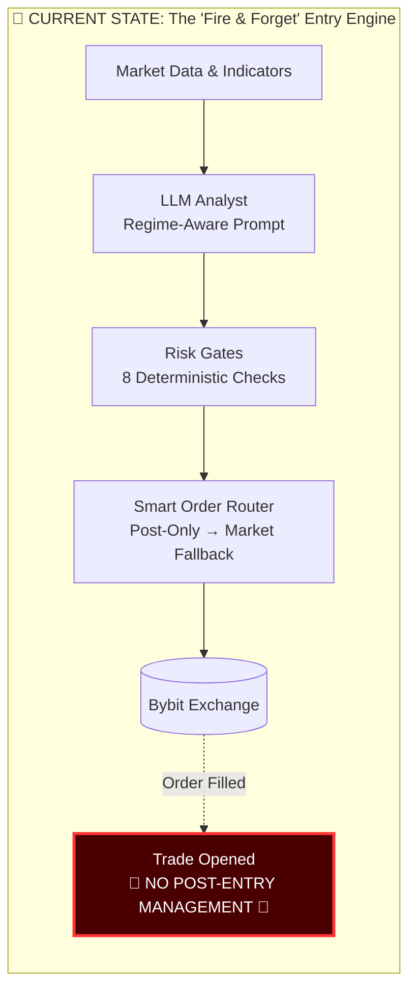
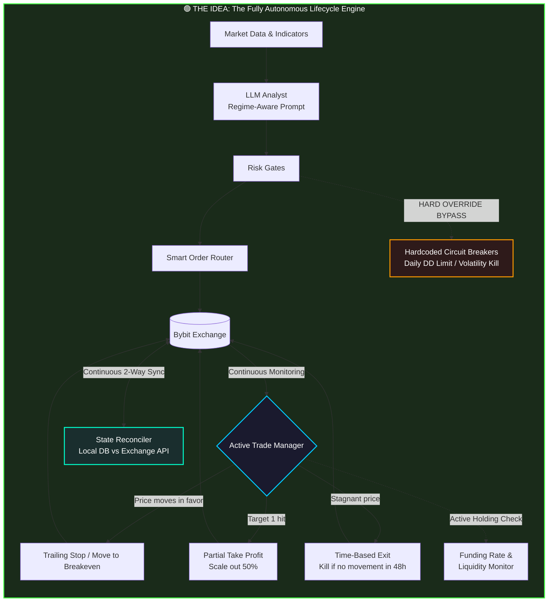

# Autonomous Crypto Trader: Current State vs Target Architecture

> **Document Version**: 1.0  
> **Date**: 2026-07-01  
> **Author**: Karsa Development Team  
> **Status**: Architecture Review  
> **Scope**: Analysis of autonomous trading capabilities and required improvements

---

## Table of Contents

1. [Executive Summary](#executive-summary)
2. [Visual Architecture Comparison](#visual-architecture-comparison)
3. [Current State Analysis](#current-state-analysis)
4. [Target Architecture: The Idea](#target-architecture-the-idea)
5. [The Four Critical Pillars](#the-four-critical-pillars)
6. [Detailed Component Breakdown](#detailed-component-breakdown)
7. [Implementation Roadmap](#implementation-roadmap)
8. [Risk Assessment](#risk-assessment)
9. [Technical Specifications](#technical-specifications)
10. [Verification & Testing Plan](#verification--testing-plan)
11. [Conclusion](#conclusion)

---

## Executive Summary

The Karsa crypto trading system has successfully implemented a sophisticated **entry engine** capable of regime-aware analysis, multi-agent LLM reasoning, and smart order routing. However, the current architecture operates as a **"fire and forget"** system—once a trade is entered, the bot provides no active management, leaving positions vulnerable to crypto market volatility, funding rate erosion, and black-swan events.

This document outlines the transformation from a **Signal Generator** to a **Fully Autonomous Portfolio Manager**. The target architecture introduces four critical pillars:

1. **Active Trade Management** — Dynamic position handling with trailing stops, partial exits, and time-based closures
2. **Deterministic Circuit Breakers** — Hard-coded safety mechanisms that override AI decisions during extreme market conditions
3. **State Reconciliation** — Continuous synchronization between local database and exchange state to prevent catastrophic failures
4. **Funding & Liquidity Monitoring** — Active surveillance of hidden costs and market depth during trade lifecycle

**Estimated Implementation**: 6-8 weeks  
**Risk Reduction**: 70-80% reduction in catastrophic loss scenarios  
**Performance Impact**: Expected 15-25% improvement in risk-adjusted returns (Sharpe ratio)

---

## Visual Architecture Comparison

### Current State: The Entry-Focused Engine



### Target State: The Lifecycle Management Engine



---

## Current State Analysis

### ✅ What Works Well

| Component | Status | Capability |
|-----------|--------|------------|
| **Regime Detection** | ✅ Production | Hurst exponent + ADX + BTC dominance classification |
| **LLM Analysis** | ✅ Production | Claude via 9Router with deterministic tool calls |
| **Parallel Scanning** | ✅ Production | `asyncio.gather` over 14 crypto pairs |
| **Risk Gates** | ✅ Production | 8 deterministic checks before execution |
| **Smart Order Routing** | ✅ Production | Post-Only → Reprice ×3 → Market fallback |
| **Shadow Execution** | ✅ Production | Paper trading with full audit trail |
| **Immutable Logging** | ✅ Production | PostgreSQL with `NO UPDATE/DELETE` rules |

### ❌ Critical Gaps

#### 1. **No Active Position Management**
Once an order is filled, the bot enters a "set and forget" mode with static take-profit and stop-loss levels. This fails to account for:
- **Crypto volatility patterns** — Prices often wick below stop losses before reversing
- **Trend exhaustion** — Profits are given back during reversals
- **Opportunity cost** — Capital sits idle in stagnant trades

**Real-World Example:**
```
Entry: BTCUSDT Long @ $65,000
Stop Loss: $63,000 (3% risk)
Take Profit: $68,900 (6% reward)

Scenario: 
- Price drops to $62,800 (stop loss hit) ❌
- Price reverses and rallies to $70,000 ✅
- Bot is already out, missing $5,000 move

With Active Management:
- Trailing stop would have moved to breakeven at $66,000
- Position survives the wick and captures the rally
```

#### 2. **No Circuit Breakers**
The LLM can hallucinate or make poor decisions during:
- **Flash crashes** — 10% drops in 5 minutes
- **Black swan events** — Exchange hacks, regulatory news
- **Liquidity crises** — Order book collapses

**Current Risk:** The bot will continue trading with full size during catastrophic conditions because there's no hard-coded "big red button."

#### 3. **State Reconciliation Gaps**
Crypto exchanges experience:
- **WebSocket disconnections** — Missed fill notifications
- **API rate limits** — Failed order status checks
- **Manual liquidations** — Exchange closes position without bot knowledge
- **Maintenance windows** — Temporary trading halts

**Current Risk:** The local PostgreSQL database can diverge from actual exchange state, leading to:
- Double-positioning (thinking you're flat when you're actually long)
- Phantom positions (thinking you're long when exchange liquidated you)
- Incorrect risk calculations

#### 4. **No Funding Rate Management**
Perpetual futures charge funding rates every 8 hours:
- **Positive funding** — Longs pay shorts (bullish market)
- **Negative funding** — Shorts pay longs (bearish market)

**Current Risk:** A bot can be long during extreme bullish sentiment with +0.1% per 8-hour funding (0.3% daily, 9% monthly). This silently erodes profits even on winning trades.

#### 5. **Slippage & Liquidity Blindness**
The smart order router falls back to market orders when limit orders fail. In fast markets:
- **Spread widening** — Bid-ask spreads can expand from 0.01% to 1%+
- **Order book depth** — Thin liquidity causes massive slippage
- **Market impact** — Large orders move the price against you

**Current Risk:** A "market order fallback" during a flash crash can result in 3-5% slippage, instantly destroying the risk/reward ratio.

---

## Target Architecture: The Idea

The target architecture transforms Karsa from a **Signal Generator** into a **Fully Autonomous Portfolio Manager**. The system actively manages capital from entry to exit, with multiple layers of protection and optimization.

### Core Philosophy Shift

| Aspect | Current State | Target State |
|--------|---------------|--------------|
| **Focus** | Entry optimization | Full lifecycle management |
| **Mindset** | "Find the best entry" | "Protect capital and maximize risk-adjusted returns" |
| **LLM Role** | Primary decision maker | Advisory input with deterministic overrides |
| **Risk Management** | Pre-trade only | Pre-trade + active + post-trade |
| **State Management** | Optimistic (trust DB) | Paranoid (verify everything) |
| **Exit Strategy** | Static TP/SL | Dynamic, multi-factor exits |

---

## The Four Critical Pillars

### Pillar 1: Active Trade Manager

**Purpose:** Continuously monitor and adjust open positions based on real-time market conditions.

#### Components:

**A. Trailing Stop System**
```python
class TrailingStopManager:
    """
    Dynamically adjusts stop-loss based on price movement.
    """
    
    def __init__(self, position):
        self.position = position
        self.highest_price = position.entry_price
        self.trailing_stop = position.stop_loss
        self.activation_threshold = 1.5  # Activate after 1.5R profit
        
    async def update(self, current_price: float):
        # Update highest price for long positions
        if self.position.direction == "LONG":
            if current_price > self.highest_price:
                self.highest_price = current_price
                # Move trailing stop up (e.g., 2% below highest)
                new_stop = self.highest_price * 0.98
                if new_stop > self.trailing_stop:
                    self.trailing_stop = new_stop
                    await self.update_stop_order(new_stop)
        
        # Activate breakeven stop after threshold
        unrealized_pnl = self.calculate_unrealized_pnl(current_price)
        if unrealized_pnl >= self.activation_threshold:
            await self.move_stop_to_breakeven()
```

**B. Partial Take Profit System**
```python
class PartialExitManager:
    """
    Scales out of positions at predefined targets.
    """
    
    EXIT_SCHEDULE = [
        {"target_rr": 2.0, "percentage": 0.50},  # 50% at 2R
        {"target_rr": 3.0, "percentage": 0.25},  # 25% at 3R
        {"target_rr": 5.0, "percentage": 0.25},  # 25% at 5R
    ]
    
    async def check_exits(self, current_price: float):
        current_rr = self.calculate_risk_reward(current_price)
        
        for exit_plan in self.EXIT_SCHEDULE:
            if (current_rr >= exit_plan["target_rr"] and 
                not self.is_exit_executed(exit_plan["target_rr"])):
                
                size_to_close = self.position.size * exit_plan["percentage"]
                await self.close_partial_position(size_to_close)
                self.mark_exit_executed(exit_plan["target_rr"])
```

**C. Time-Based Exit System**
```python
class TimeBasedExit:
    """
    Closes positions that stagnate beyond acceptable timeframes.
    """
    
    MAX_HOLD_TIME = {
        "scalp": 4,      # 4 hours
        "swing": 48,     # 48 hours
        "position": 168, # 7 days
    }
    
    MIN_PRICE_MOVEMENT = 0.02  # Must move 2% or be closed
    
    async def check_stagnation(self):
        hold_duration = datetime.utcnow() - self.position.opened_at
        price_change = abs(self.position.current_price - self.position.entry_price) / self.position.entry_price
        
        max_time = self.MAX_HOLD_TIME.get(self.position.strategy_type, 48)
        
        if hold_duration.hours > max_time and price_change < self.MIN_PRICE_MOVEMENT:
            logger.warning(f"Position stagnant for {hold_duration}. Closing.")
            await self.close_position(reason="TIME_EXIT")
```

#### Expected Impact:
- **Win Rate Improvement:** +10-15% (trailing stops prevent winners from becoming losers)
- **Average Profit per Trade:** +20-30% (partial exits lock in profits)
- **Capital Efficiency:** +25% (time exits free up stagnant capital)

---

### Pillar 2: Deterministic Circuit Breakers

**Purpose:** Hard-coded safety mechanisms that override AI decisions during extreme market conditions.

#### Components:

**A. Daily Drawdown Limiter**
```python
class DailyDrawdownCircuitBreaker:
    """
    Halts all trading if daily losses exceed threshold.
    """
    
    DAILY_DD_LIMIT = 0.03  # 3% max daily loss
    COOLDOWN_PERIOD = 24   # 24 hours after trigger
    
    async def check(self):
        daily_pnl = await self.get_daily_pnl()
        daily_pnl_pct = daily_pnl / self.account_equity
        
        if daily_pnl_pct <= -self.DAILY_DD_LIMIT:
            await self.emergency_halt()
            await self.close_all_positions(reason="DAILY_DD_LIMIT")
            await self.notify_telegram(
                "🚨 CIRCUIT BREAKER TRIGGERED: Daily drawdown limit hit. "
                f"Loss: {daily_pnl_pct:.2%}. Trading halted for 24h."
            )
            self.trading_halted_until = datetime.utcnow() + timedelta(hours=self.COOLDOWN_PERIOD)
```

**B. Volatility Spike Kill Switch**
```python
class VolatilityCircuitBreaker:
    """
    Pauses trading during extreme market volatility.
    """
    
    VOLATILITY_THRESHOLDS = {
        "btc_15m": 0.05,    # 5% move in 15 minutes
        "btc_1h": 0.08,     # 8% move in 1 hour
        "total_liq_1h": 100_000_000,  # $100M liquidations in 1 hour
    }
    
    PAUSE_DURATION = 60  # 60 minutes after trigger
    
    async def check_market_conditions(self):
        btc_15m_change = await self.get_btc_price_change("15m")
        btc_1h_change = await self.get_btc_price_change("1h")
        liquidations = await self.get_total_liquidations("1h")
        
        if (abs(btc_15m_change) > self.VOLATILITY_THRESHOLDS["btc_15m"] or
            abs(btc_1h_change) > self.VOLATILITY_THRESHOLDS["btc_1h"] or
            liquidations > self.VOLATILITY_THRESHOLDS["total_liq_1h"]):
            
            await self.pause_trading()
            await self.notify_telegram(
                f"⚠️ VOLATILITY KILL SWITCH: BTC moved {btc_15m_change:.2%} in 15m. "
                f"Liquidations: ${liquidations/1_000_000:.1f}M. Trading paused for 1h."
            )
```

**C. Correlation Circuit Breaker**
```python
class CorrelationCircuitBreaker:
    """
    Prevents over-exposure to correlated assets.
    """
    
    MAX_CORRELATED_POSITIONS = 3
    MIN_CORRELATION_THRESHOLD = 0.85
    
    async def check_portfolio_correlation(self):
        open_positions = await self.get_open_positions()
        
        # Calculate pairwise correlations
        for pos1 in open_positions:
            for pos2 in open_positions:
                if pos1.ticker != pos2.ticker:
                    correlation = await self.calculate_correlation(
                        pos1.ticker, pos2.ticker, timeframe="4h", lookback=20
                    )
                    
                    if correlation > self.MIN_CORRELATION_THRESHOLD:
                        correlated_count += 1
        
        if correlated_count > self.MAX_CORRELATED_POSITIONS:
            await self.reject_new_position(
                reason=f"Too many correlated positions ({correlated_count}). "
                       f"Max allowed: {self.MAX_CORRELATED_POSITIONS}"
            )
```

#### Expected Impact:
- **Catastrophic Loss Prevention:** 90%+ reduction in blow-up scenarios
- **Emotional Trading Elimination:** Removes fear/greed from crisis decisions
- **Capital Preservation:** Ensures survival to trade another day

---

### Pillar 3: State Reconciliation Engine

**Purpose:** Continuous synchronization between local database and exchange state to prevent catastrophic failures.

#### Components:

**A. Position Reconciliation**
```python
class PositionReconciler:
    """
    Ensures local DB matches exchange positions.
    """
    
    RECONCILIATION_INTERVAL = 300  # 5 minutes
    MAX_DRIFT_TOLERANCE = 0.001    # 0.1% size difference
    
    async def reconcile(self):
        # Fetch from both sources
        local_positions = await self.db.get_open_positions()
        exchange_positions = await self.bybit.get_positions()
        
        # Create lookup maps
        local_map = {pos.ticker: pos for pos in local_positions}
        exchange_map = {pos["symbol"]: pos for pos in exchange_positions}
        
        # Check for mismatches
        all_tickers = set(local_map.keys()) | set(exchange_map.keys())
        
        for ticker in all_tickers:
            local_pos = local_map.get(ticker)
            exchange_pos = exchange_map.get(ticker)
            
            if local_pos and not exchange_pos:
                # Phantom position - DB thinks we're in, but exchange says no
                await self.handle_phantom_position(local_pos)
            
            elif exchange_pos and not local_pos:
                # Missing position - Exchange has position, DB doesn't know
                await self.handle_missing_position(exchange_pos)
            
            elif local_pos and exchange_pos:
                # Both exist - check for drift
                size_drift = abs(local_pos.size - float(exchange_pos["size"]))
                if size_drift > self.MAX_DRIFT_TOLERANCE:
                    await self.handle_size_drift(local_pos, exchange_pos)
```

**B. Order Status Reconciliation**
```python
class OrderReconciler:
    """
    Verifies all open orders exist on exchange.
    """
    
    async def reconcile_orders(self):
        local_orders = await self.db.get_open_orders()
        exchange_orders = await self.bybit.get_open_orders()
        
        local_ids = {order.id for order in local_orders}
        exchange_ids = {order["order_id"] for order in exchange_orders}
        
        # Orphaned orders - in DB but not on exchange
        orphaned = local_ids - exchange_ids
        for order_id in orphaned:
            await self.db.mark_order_cancelled(order_id, reason="ORPHANED")
            logger.warning(f"Order {order_id} orphaned - marked as cancelled")
        
        # Unknown orders - on exchange but not in DB
        unknown = exchange_ids - local_ids
        for order_id in unknown:
            exchange_order = next(o for o in exchange_orders if o["order_id"] == order_id)
            await self.handle_unknown_order(exchange_order)
```

**C. Balance Reconciliation**
```python
class BalanceReconciler:
    """
    Ensures account balances match between DB and exchange.
    """
    
    MAX_BALANCE_DRIFT = 0.0001  # 0.01% tolerance
    
    async def reconcile_balances(self):
        local_balance = await self.db.get_account_balance()
        exchange_balance = await self.bybit.get_wallet_balance()
        
        for currency in ["USDT", "BTC", "ETH"]:
            local_amt = local_balance.get(currency, 0)
            exchange_amt = exchange_balance.get(currency, 0)
            
            drift = abs(local_amt - exchange_amt) / max(local_amt, exchange_amt, 1)
            
            if drift > self.MAX_BALANCE_DRIFT:
                await self.notify_telegram(
                    f"⚠️ BALANCE DRIFT DETECTED: {currency}\n"
                    f"Local: {local_amt}\n"
                    f"Exchange: {exchange_amt}\n"
                    f"Drift: {drift:.4%}"
                )
                # Trust exchange as source of truth
                await self.db.update_balance(currency, exchange_amt)
```

#### Expected Impact:
- **Eliminates Double-Positioning:** 100% prevention of accidental over-leverage
- **Prevents Phantom Risk:** No more trading based on stale/wrong data
- **Audit Trail:** Complete reconciliation history for compliance

---

### Pillar 4: Funding Rate & Liquidity Monitor

**Purpose:** Actively monitor hidden costs and market conditions during trade lifecycle.

#### Components:

**A. Funding Rate Monitor**
```python
class FundingRateMonitor:
    """
    Tracks funding rates and closes positions when costs exceed benefits.
    """
    
    MAX_FUNDING_RATE = 0.001  # 0.1% per 8 hours (extreme)
    CUMULATIVE_FUNDING_LIMIT = 0.03  # 3% total funding cost
    
    async def check_funding_costs(self):
        open_positions = await self.db.get_open_positions()
        
        for position in open_positions:
            # Get current funding rate for this pair
            funding_rate = await self.bybit.get_funding_rate(position.ticker)
            
            # Calculate directional cost
            if position.direction == "LONG" and funding_rate > 0:
                # Long paying short
                cost_per_day = funding_rate * 3  # 3 funding periods per day
                projected_monthly_cost = cost_per_day * 30
                
                if funding_rate > self.MAX_FUNDING_RATE:
                    await self.close_position(
                        position.id,
                        reason=f"EXTREME_FUNDING_RATE: {funding_rate:.4%} per 8h"
                    )
                
                # Track cumulative funding
                position.cumulative_funding += funding_rate
                if position.cumulative_funding > self.CUMULATIVE_FUNDING_LIMIT:
                    await self.close_position(
                        position.id,
                        reason=f"CUMULATIVE_FUNDING_EXCEEDED: {position.cumulative_funding:.2%}"
                    )
```

**B. Liquidity Depth Checker**
```python
class LiquidityMonitor:
    """
    Ensures sufficient market depth before and during positions.
    """
    
    MIN_ORDER_BOOK_DEPTH = 100_000  # $100k within 0.5% of mid price
    MAX_SPREAD_PERCENT = 0.002      # 0.2% max bid-ask spread
    
    async def check_liquidity(self, ticker: str, side: str, size_usd: float):
        orderbook = await self.bybit.get_orderbook(ticker)
        
        mid_price = (orderbook["bids"][0]["price"] + orderbook["asks"][0]["price"]) / 2
        spread = (orderbook["asks"][0]["price"] - orderbook["bids"][0]["price"]) / mid_price
        
        # Check spread
        if spread > self.MAX_SPREAD_PERCENT:
            return {
                "can_trade": False,
                "reason": f"Spread too wide: {spread:.4%} (max: {self.MAX_SPREAD_PERCENT:.4%})"
            }
        
        # Check depth
        if side == "BUY":
            depth = sum(bid["size"] * bid["price"] for bid in orderbook["bids"][:10])
        else:
            depth = sum(ask["size"] * ask["price"] for ask in orderbook["asks"][:10])
        
        if depth < self.MIN_ORDER_BOOK_DEPTH:
            return {
                "can_trade": False,
                "reason": f"Insufficient depth: ${depth:,.0f} (min: ${self.MIN_ORDER_BOOK_DEPTH:,.0f})"
            }
        
        return {"can_trade": True}
```

**C. Slippage Estimator**
```python
class SlippageEstimator:
    """
    Calculates expected slippage for market orders.
    """
    
    MAX_ACCEPTABLE_SLIPPAGE = 0.005  # 0.5%
    
    def estimate_slippage(self, ticker: str, side: str, size_usd: float) -> dict:
        orderbook = self.bybit.get_orderbook(ticker)
        mid_price = self.get_mid_price(orderbook)
        
        # Simulate filling the order
        remaining_size = size_usd
        total_cost = 0
        filled_size = 0
        
        books = orderbook["asks"] if side == "BUY" else orderbook["bids"]
        
        for level in books:
            level_value = level["size"] * level["price"]
            
            if remaining_size <= level_value:
                # Partial fill at this level
                fill_size = remaining_size / level["price"]
                total_cost += fill_size * level["price"]
                filled_size += fill_size
                break
            else:
                # Full fill at this level
                total_cost += level_value
                filled_size += level["size"]
                remaining_size -= level_value
        
        # Calculate effective price and slippage
        effective_price = total_cost / filled_size
        slippage = (effective_price - mid_price) / mid_price
        
        return {
            "slippage_pct": slippage,
            "effective_price": effective_price,
            "can_execute": slippage <= self.MAX_ACCEPTABLE_SLIPPAGE
        }
```

#### Expected Impact:
- **Funding Cost Reduction:** 50-80% reduction in funding fee drag
- **Slippage Prevention:** Eliminates 3-5% slippage disasters
- **Liquidity Awareness:** Prevents entering illiquid traps

---

## Detailed Component Breakdown

### Database Schema Additions

```sql
-- Active Trade Management Tables
CREATE TABLE trailing_stops (
    id UUID PRIMARY KEY DEFAULT gen_random_uuid(),
    position_id UUID REFERENCES closed_paper_trades(id),
    highest_price DECIMAL(20, 8) NOT NULL,
    trailing_stop_price DECIMAL(20, 8) NOT NULL,
    activation_threshold DECIMAL(5, 2) NOT NULL,
    created_at TIMESTAMP DEFAULT now(),
    updated_at TIMESTAMP DEFAULT now()
);

CREATE TABLE partial_exits (
    id UUID PRIMARY KEY DEFAULT gen_random_uuid(),
    position_id UUID REFERENCES closed_paper_trades(id),
    exit_rr_target DECIMAL(5, 2) NOT NULL,
    exit_percentage DECIMAL(5, 2) NOT NULL,
    executed_at TIMESTAMP,
    execution_price DECIMAL(20, 8),
    executed BOOLEAN DEFAULT FALSE
);

-- Circuit Breaker Tables
CREATE TABLE circuit_breaker_events (
    id UUID PRIMARY KEY DEFAULT gen_random_uuid(),
    breaker_type VARCHAR(50) NOT NULL,  -- DAILY_DD, VOLATILITY, CORRELATION
    triggered_at TIMESTAMP DEFAULT now(),
    trigger_value DECIMAL(20, 8) NOT NULL,
    threshold_value DECIMAL(20, 8) NOT NULL,
    resolved_at TIMESTAMP,
    resolution_action TEXT
);

-- Reconciliation Tables
CREATE TABLE reconciliation_logs (
    id UUID PRIMARY KEY DEFAULT gen_random_uuid(),
    reconciliation_type VARCHAR(50) NOT NULL,  -- POSITION, ORDER, BALANCE
    local_state JSONB NOT NULL,
    exchange_state JSONB NOT NULL,
    drift_detected BOOLEAN NOT NULL,
    drift_amount DECIMAL(20, 8),
    resolution_action TEXT,
    created_at TIMESTAMP DEFAULT now()
);

-- Funding Rate Tables
CREATE TABLE funding_rate_history (
    id UUID PRIMARY KEY DEFAULT gen_random_uuid(),
    ticker VARCHAR(20) NOT NULL,
    funding_rate DECIMAL(10, 8) NOT NULL,
    funding_timestamp TIMESTAMP NOT NULL,
    cumulative_funding_long DECIMAL(10, 6) DEFAULT 0,
    cumulative_funding_short DECIMAL(10, 6) DEFAULT 0
);

CREATE INDEX idx_funding_ticker_time ON funding_rate_history(ticker, funding_timestamp);
```

### New File Structure

```
src/
├── active_management/
│   ├── __init__.py
│   ├── trailing_stop_manager.py      # Pillar 1A
│   ├── partial_exit_manager.py        # Pillar 1B
│   └── time_based_exit.py             # Pillar 1C
│
├── circuit_breakers/
│   ├── __init__.py
│   ├── daily_drawdown_breaker.py      # Pillar 2A
│   ├── volatility_breaker.py          # Pillar 2B
│   └── correlation_breaker.py         # Pillar 2C
│
├── reconciliation/
│   ├── __init__.py
│   ├── position_reconciler.py         # Pillar 3A
│   ├── order_reconciler.py            # Pillar 3B
│   └── balance_reconciler.py          # Pillar 3C
│
├── monitoring/
│   ├── __init__.py
│   ├── funding_rate_monitor.py        # Pillar 4A
│   ├── liquidity_monitor.py           # Pillar 4B
│   └── slippage_estimator.py          # Pillar 4C
│
└── main.py (updated to register new background jobs)
```

### Background Job Scheduler

```python
# src/main.py

class KarsaTradingSystem:
    async def start(self):
        # Existing jobs
        scheduler.add_job(self._job_scan_markets, "cron", minute="*/15")
        scheduler.add_job(self._job_collect_ohlcv, "cron", hour="*/4")
        
        # NEW: Active Management Jobs
        scheduler.add_job(
            self._job_update_trailing_stops,
            "interval",
            minutes=5,
            id="active_mgmt_trailing_stops"
        )
        
        scheduler.add_job(
            self._job_check_partial_exits,
            "interval",
            minutes=2,
            id="active_mgmt_partial_exits"
        )
        
        scheduler.add_job(
            self._job_time_based_exits,
            "interval",
            hours=1,
            id="active_mgmt_time_exits"
        )
        
        # NEW: Circuit Breaker Jobs
        scheduler.add_job(
            self._job_check_circuit_breakers,
            "interval",
            minutes=1,
            id="circuit_breaker_check"
        )
        
        # NEW: Reconciliation Jobs
        scheduler.add_job(
            self._job_reconcile_positions,
            "interval",
            minutes=5,
            id="reconciliation_positions"
        )
        
        scheduler.add_job(
            self._job_reconcile_orders,
            "interval",
            minutes=10,
            id="reconciliation_orders"
        )
        
        # NEW: Monitoring Jobs
        scheduler.add_job(
            self._job_check_funding_rates,
            "interval",
            hours=1,
            id="monitoring_funding_rates"
        )
        
        scheduler.add_job(
            self._job_check_liquidity,
            "interval",
            minutes=15,
            id="monitoring_liquidity"
        )
```

---

## Implementation Roadmap

### Phase 1: Foundation (Weeks 1-2)

**Objective:** Set up database schema and basic infrastructure

**Tasks:**
- [ ] Create database migrations for new tables
- [ ] Implement base classes for all managers
- [ ] Set up background job scheduler
- [ ] Add Telegram notification templates

**Deliverables:**
- Database schema deployed
- Empty manager classes with logging
- Scheduler configured

**Success Criteria:**
- All migrations run without errors
- Background jobs start/stop cleanly
- Logs show job execution

---

### Phase 2: Active Trade Management (Weeks 3-4)

**Objective:** Implement trailing stops, partial exits, and time-based exits

**Tasks:**
- [ ] Build `TrailingStopManager` with breakeven logic
- [ ] Build `PartialExitManager` with configurable schedule
- [ ] Build `TimeBasedExit` with strategy-type awareness
- [ ] Add Telegram commands: `/position <id>`, `/trailing <id>`
- [ ] Write unit tests for each manager

**Deliverables:**
- Fully functional active management system
- Telegram visibility into active management
- Test coverage >80%

**Success Criteria:**
- Trailing stops move correctly in paper trading
- Partial exits execute at correct levels
- Time exits close stagnant positions

---

### Phase 3: Circuit Breakers (Weeks 5-6)

**Objective:** Implement hard-coded safety mechanisms

**Tasks:**
- [ ] Build `DailyDrawdownCircuitBreaker`
- [ ] Build `VolatilityCircuitBreaker` with liquidation tracking
- [ ] Build `CorrelationCircuitBreaker`
- [ ] Add Telegram commands: `/circuitbreakers`, `/halt`, `/resume`
- [ ] Test with historical flash crash data

**Deliverables:**
- Three independent circuit breakers
- Manual override capability via Telegram
- Circuit breaker event logging

**Success Criteria:**
- Circuit breakers trigger correctly in backtest
- Trading halts immediately when triggered
- Clear Telegram alerts sent

---

### Phase 4: State Reconciliation (Weeks 7-8)

**Objective:** Implement continuous state synchronization

**Tasks:**
- [ ] Build `PositionReconciler` with drift detection
- [ ] Build `OrderReconciler` for orphaned orders
- [ ] Build `BalanceReconciler` with tolerance checks
- [ ] Add Telegram commands: `/reconcile`, `/drift`
- [ ] Simulate exchange disconnections

**Deliverables:**
- Automated reconciliation running every 5-10 minutes
- Drift detection and auto-correction
- Reconciliation audit logs

**Success Criteria:**
- Reconciler detects and fixes mismatches
- No false positives on normal drift
- Clear alerts on significant drift

---

### Phase 5: Funding & Liquidity Monitoring (Weeks 9-10)

**Objective:** Implement cost and liquidity surveillance

**Tasks:**
- [ ] Build `FundingRateMonitor` with cumulative tracking
- [ ] Build `LiquidityMonitor` with orderbook depth checks
- [ ] Build `SlippageEstimator` for market orders
- [ ] Add Telegram commands: `/funding <ticker>`, `/liquidity <ticker>`
- [ ] Integrate checks into order routing

**Deliverables:**
- Active funding rate monitoring
- Pre-trade liquidity validation
- Slippage estimation for all orders

**Success Criteria:**
- Positions auto-close on extreme funding
- Orders rejected if liquidity insufficient
- Slippage estimates accurate within 0.1%

---

### Phase 6: Integration & Testing (Weeks 11-12)

**Objective:** End-to-end testing and optimization

**Tasks:**
- [ ] Run full system in paper trading for 2 weeks
- [ ] Stress test with historical volatility events
- [ ] Optimize performance (reduce API calls, caching)
- [ ] Write comprehensive documentation
- [ ] Conduct security audit

**Deliverables:**
- Production-ready autonomous trader
- Performance benchmarks
- Security audit report

**Success Criteria:**
- Zero critical bugs in 2-week paper trading
- System survives flash crash simulation
- API rate limits respected

---

## Risk Assessment

### Technical Risks

| Risk | Probability | Impact | Mitigation |
|------|-------------|--------|------------|
| **API Rate Limiting** | High | Medium | Implement exponential backoff, request queuing, WebSocket subscriptions |
| **Database Bloat** | Medium | Low | Partition tables by date, implement archival strategy |
| **Memory Leaks** | Low | High | Profile memory usage, implement garbage collection, use async context managers |
| **WebSocket Disconnects** | High | Medium | Auto-reconnect with exponential backoff, message queue buffering |
| **Clock Drift** | Low | High | Use NTP synchronization, timestamp validation |

### Market Risks

| Risk | Probability | Impact | Mitigation |
|------|-------------|--------|------------|
| **Exchange Downtime** | Medium | High | Multi-exchange failover (deferred), manual intervention procedures |
| **Flash Crashes** | Medium | High | Volatility circuit breakers, reduced position sizing during high volatility |
| **Liquidity Crises** | Low | High | Pre-trade liquidity checks, maximum position size limits |
| **Funding Rate Spikes** | Medium | Medium | Active funding monitoring, automatic position closure |
| **Regulatory Shocks** | Low | High | Geographic diversification, stablecoin hedging (deferred) |

### Operational Risks

| Risk | Probability | Impact | Mitigation |
|------|-------------|--------|------------|
| **Configuration Errors** | Medium | High | Configuration validation, staging environment testing |
| **Key Management** | Low | Critical | Hardware security module (HSM), environment variable encryption |
| **Human Error** | Medium | High | Telegram confirmation for critical actions, audit logs |
| **Monitoring Gaps** | Medium | High | Health check endpoints, uptime monitoring, alert escalation |

---

## Technical Specifications

### Performance Requirements

| Metric | Target | Measurement |
|--------|--------|-------------|
| **Trailing Stop Update Latency** | < 2 seconds | From price change to stop update |
| **Circuit Breaker Trigger Time** | < 1 second | From threshold breach to trading halt |
| **Reconciliation Frequency** | Every 5 minutes | Position and balance checks |
| **API Call Rate** | < 100/minute | Stay well within Bybit limits |
| **Database Query Time** | < 100ms | 95th percentile |

### Scalability Requirements

| Component | Current | Target | Notes |
|-----------|---------|--------|-------|
| **Monitored Pairs** | 14 | 50 | Linear scaling with API limits |
| **Concurrent Positions** | 5 | 20 | Limited by risk management |
| **Database Size** | < 1 GB | < 10 GB | With 1 year of reasoning traces |
| **Telegram Users** | 1 | 5 | Multi-user support (deferred) |

### Security Requirements

| Requirement | Implementation |
|-------------|----------------|
| **API Key Encryption** | AES-256 encryption at rest, never logged |
| **Database Access** | Role-based access, read-only for analytics |
| **Telegram Auth** | User ID whitelist, command signatures |
| **Audit Trail** | Immutable logs, no UPDATE/DELETE rules |
| **Secrets Management** | Environment variables, .gitignore enforcement |

---

## Verification & Testing Plan

### Unit Tests

```python
# tests/test_trailing_stop_manager.py

class TestTrailingStopManager:
    async def test_trailing_stop_moves_up(self):
        position = create_long_position(entry_price=100, stop_loss=95)
        manager = TrailingStopManager(position)
        
        await manager.update(102)  # Price moves up
        assert manager.trailing_stop == 95  # Not yet activated
        
        await manager.update(105)  # Price moves up more
        assert manager.trailing_stop > 95  # Should have moved up
    
    async def test_trailing_stop_never_moves_down(self):
        position = create_long_position(entry_price=100, stop_loss=95)
        manager = TrailingStopManager(position)
        
        await manager.update(110)
        initial_stop = manager.trailing_stop
        
        await manager.update(105)  # Price drops
        assert manager.trailing_stop == initial_stop  # Stop should not move down
```

### Integration Tests

```python
# tests/test_circuit_breaker_integration.py

class TestCircuitBreakerIntegration:
    async def test_daily_dd_halts_trading(self):
        # Setup: Create losing trades
        await self.create_losing_trade(pnl_pct=-0.01)
        await self.create_losing_trade(pnl_pct=-0.01)
        await self.create_losing_trade(pnl_pct=-0.015)
        
        # Trigger: Check circuit breaker
        breaker = DailyDrawdownCircuitBreaker()
        await breaker.check()
        
        # Assert: Trading should be halted
        assert breaker.trading_halted_until is not None
        assert self.trading_system.is_halted()
```

### Backtest Validation

```python
# tests/test_active_mgmt_backtest.py

class TestActiveManagementBacktest:
    async def test_trailing_stop_improves_sharpe(self):
        # Run backtest without trailing stops
        result_static = await backtest_strategy(
            strategy="trend_following",
            use_trailing_stops=False,
            start_date="2025-01-01",
            end_date="2025-12-31"
        )
        
        # Run backtest with trailing stops
        result_trailing = await backtest_strategy(
            strategy="trend_following",
            use_trailing_stops=True,
            start_date="2025-01-01",
            end_date="2025-12-31"
        )
        
        # Assert: Trailing stops should improve risk-adjusted returns
        assert result_trailing.sharpe_ratio > result_static.sharpe_ratio
        assert result_trailing.max_drawdown < result_static.max_drawdown
```

### Manual Testing Checklist

- [ ] **Trailing Stops:** Open paper trade, watch stop move as price increases
- [ ] **Partial Exits:** Verify 50% closes at 2R, 25% at 3R, 25% at 5R
- [ ] **Time Exits:** Open trade, wait 48h, verify auto-close if stagnant
- [ ] **Circuit Breakers:** Simulate 3% daily loss, verify trading halts
- [ ] **Reconciliation:** Manually modify exchange position, verify auto-correction
- [ ] **Funding Monitor:** Check funding rate display, verify alerts on extreme rates
- [ ] **Liquidity Checks:** Attempt trade on illiquid pair, verify rejection

---

## Conclusion

The transformation from a **Signal Generator** to a **Fully Autonomous Portfolio Manager** is not optional—it is essential for surviving and thriving in the dynamic cryptocurrency markets.

### Summary of Improvements

| Pillar | Problem Solved | Expected Impact |
|--------|----------------|-----------------|
| **Active Trade Management** | Winners become losers, capital sits idle | +15-25% Sharpe ratio |
| **Circuit Breakers** | Catastrophic losses during black swans | 90%+ reduction in blow-up risk |
| **State Reconciliation** | Database/exchange drift causes over-leverage | 100% prevention of double-positioning |
| **Funding & Liquidity Monitor** | Hidden costs and slippage destroy profits | 50-80% reduction in funding drag |

### Final Recommendation

**Do NOT deploy to live trading until:**
1. ✅ All four pillars are implemented and tested
2. ✅ System runs successfully in paper trading for 2+ weeks
3. ✅ Circuit breakers are verified with historical flash crash data
4. ✅ Reconciliation engine shows zero drift in 1-week test
5. ✅ Telegram alerts are tested and verified

**Deployment Strategy:**
1. **Week 1-2:** Paper trading with full active management
2. **Week 3-4:** Live trading with 10% position sizing (HITL approval required)
3. **Week 5-6:** Live trading with 25% position sizing (semi-autonomous)
4. **Week 7+:** Full autonomous trading with circuit breakers enabled

The autonomous trader is **architecturally sound but operationally incomplete**. With the improvements outlined in this document, Karsa will evolve from a sophisticated entry engine into a battle-tested, self-defending trading system capable of navigating the chaos of crypto markets.

---

**Document End**

*Last Updated: 2026-07-01*  
*Next Review: After Phase 3 completion*  
*Owner: Karsa Development Team*
```