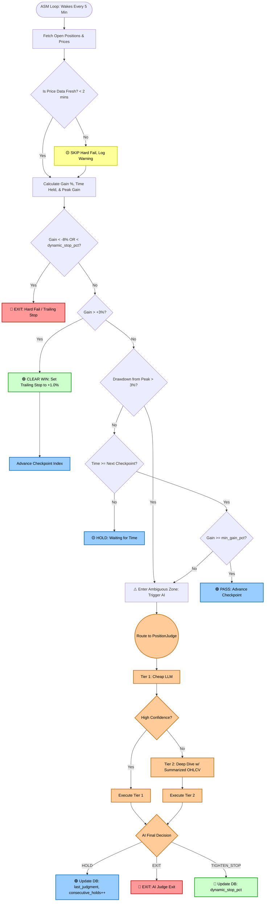

### 🚨 Critical Logic Traps (Must Fix)

#### Trap #1: The "Clear Win" Dump (The +3% Trap)
**The Flaw:** In Phase 2, if a coin pumps to `+4%`, the ASM says "Clear Win! -> HOLD" and advances the checkpoint. But what if the coin immediately dumps to `-5%` five minutes later? 
Because it advanced the checkpoint, the next check might be the 4-hour checkpoint (which allows `-2%`). The bot will hold a `-5%` position, completely forgetting it was just up `+4%`.
**The Fix:** A "Clear Win" **must** automatically activate a trailing stop. When it crosses `+3%`, the ASM should instantly write `dynamic_stop_pct = 1.0%` (or your breakeven fee amount) to the database. If it dumps, the trailing stop catches it, not the scheduled checkpoint.

#### Trap #2: The "Mid-Checkpoint" Bleed Blindspot
**The Flaw:** Look at the time between checkpoints. If a Meme coin passes the 1-hour checkpoint (at `+1.5%`), the next checkpoint is at 2 hours. What happens at **1 hour and 45 minutes** if the price drops to `-4%`? 
The ASM just says "Waiting for time" and does **nothing**. It doesn't trigger the AI, and it hasn't hit the `-8%` hard fail. It just bleeds silently for 15 more minutes.
**The Fix:** You need a **"Drawdown from Peak"** check. If a position drops by more than `X%` (e.g., 3%) from its highest recorded gain *since the last checkpoint*, it should immediately trigger the AI Judge, regardless of the time schedule.

#### Trap #3: The `NULL` Dynamic Stop Crash
**The Flaw:** Your database column `dynamic_stop_pct` defaults to `NULL`. In Python, evaluating `if current_gain < position.dynamic_stop_pct` when the value is `None` will either throw a `TypeError` or evaluate incorrectly, crashing the loop or skipping the trailing stop entirely.
**The Fix:** The Python guardrail must explicitly check for `None` first: 
`if position.dynamic_stop_pct is not None and current_gain < position.dynamic_stop_pct:`

---

### ⚠️ Edge Cases (Silent Killers)

#### Edge Case #1: Stale Price Feeds / RPC Lag
**The Flaw:** If your RPC node lags or the DEX API returns a stale price, the ASM might calculate a fake `-10%` drop and trigger a Hard Fail, exiting a perfectly good trade.
**The Fix:** Add a **Price Freshness Check**. Every time you fetch the price, check the timestamp. If the price data is older than 2 minutes, **skip the Hard Fail check** for this loop and log a warning.

#### Edge Case #2: AI Infinite "HOLD" Loop
**The Flaw:** If a trade is bleeding slowly, the AI Judge might say "HOLD" at 1h, "HOLD" at 4h, and "HOLD" at 12h. The bot will hold it until it hits the `-8%` hard fail, wasting capital.
**The Fix:** Pass `consecutive_ai_holds` to the AI prompt. Add a rule to the AI's system prompt: *"If consecutive_ai_holds >= 3 and the position is still negative, you MUST exit. Do not hold a bleeding trade indefinitely."*

---

### 📊 Corrected ASM Workflow (v2)

Here is the updated Mermaid diagram with the traps and edge cases fixed.

### Summary of the Audit
By adding the **Price Freshness Check**, the **Drawdown from Peak** trigger, and forcing the **+3% Clear Win to set a trailing stop**, you have completely closed the loopholes. The ASM will no longer get tricked by fake price drops, it won't bleed silently between checkpoints, and it will actually lock in profits when a coin pumps. 