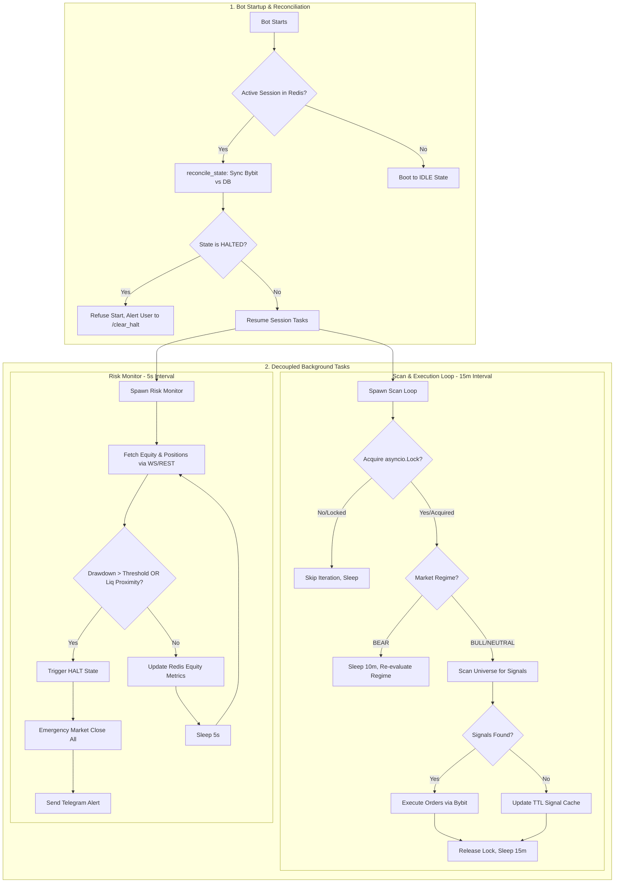
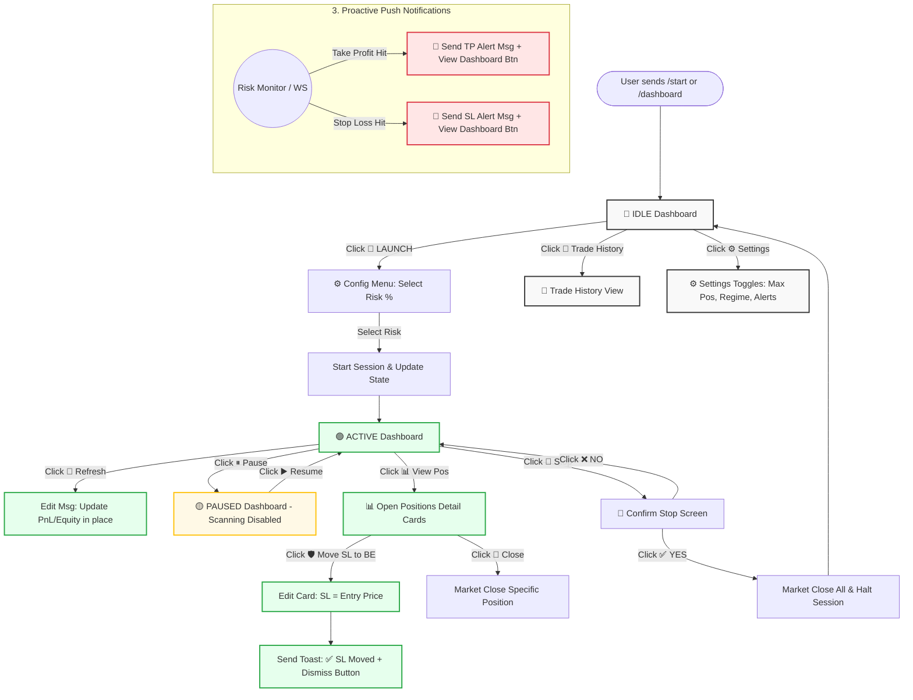

# 🔄 ASM Telegram Bot: Workflow Visualizations

## 1. System Architecture & Decoupled Background Tasks
This diagram illustrates the bot's internal logic, highlighting the shift from a monolithic loop to **decoupled background tasks** (Scan Loop vs. Risk Monitor) and the critical **Startup Reconciliation** phase.

***

## 2. Telegram UI State Machine & User Flow
This diagram maps out the exact user journey through the Telegram interface. It emphasizes the **"Edit-over-Send"** paradigm, where most dashboard interactions update the existing message in place to prevent chat spam.

---

### Key Workflow Takeaways from the Visuals:

1. **Decoupled Execution:** The `Scan Loop` (15m) and `Risk Monitor` (5s) operate completely independently. If the Scan Loop is slow or blocked by the `asyncio.Lock`, the Risk Monitor continues to protect the capital every 5 seconds.
2. **State Persistence:** The startup flow explicitly checks for a `HALTED` state. The bot will *never* auto-resume trading after a crash if it was previously halted due to a drawdown.
3. **Frictionless but Safe UI:** The user can launch a session with a single click (no duration or high-risk friction screens), but destructive actions like `🛑 Stop` require a dedicated confirmation step.
4. **Clean Chat History:** By utilizing `edit_message_text` for Refresh, Pause, and Move SL to BE, the chat history remains a clean, single "Dashboard" message rather than a cluttered feed of updates. Only critical events (TP/SL hits) generate *new* messages.