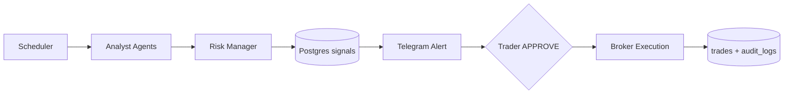

# Investment Trader Audit — Karsa Claude Trading

**Date:** 26 June 2026  
**Persona:** Active discretionary/systematic trader covering IDX blue-chips and US equities/ETFs  
**Goal:** Scan market data → surface actionable trade setups → approve and execute with proper risk controls  
**Verdict:** Well-architected **prototype scaffold** (~25–35% complete). **Not safe or reliable for live trading today.**

---

## Executive Summary

Karsa is designed as an AI-assisted trading assistant: scheduled scans across IDX, US, and ETFs; LLM analysts propose setups; a risk agent validates; Telegram delivers human-in-the-loop (HITL) approval; brokers execute.

The **blueprint is sound** for a trader who wants scan → alert → approve → trade. The **implementation is fragmented**: the scheduled scan path stops before risk checks, persistence, or alerts; the approval buttons cannot execute trades; market data is too shallow for the stated strategies; and risk/compliance is mostly prompt text, not enforced code.

`docs/PROGRESS.md` marks all 5 phases complete and says "Deployment Ready." As a trader, treat that as **overstated** until the gaps in this document are closed.

---

## What I Expected vs What I Got

| Trader need | Designed | Actual today |
|---|---|---|
| Auto-scan watchlist during market hours | ✅ Cron every 30 min | ⚠️ Runs LLM scans, logs count, **stops** |
| Push high-conviction alerts to phone | ✅ Telegram + Redis pub/sub | ❌ No Redis subscriber; signals never saved to DB |
| One-tap approve → broker order | ✅ HITL flow | ❌ Buttons use `id: "unknown"`; no DB record |
| IDX foreign flow + ARA-aware entries | ✅ Strategy + adapter | ⚠️ Adapter exists; OHLCV is 1 candle; ARA not enforced at execution |
| US momentum / ETF mean reversion | ✅ Agent prompts | ⚠️ Needs 60-day RS, 200 EMA, 20-day BB — **data doesn't support this** |
| Portfolio-aware position sizing | ✅ Risk manager | ❌ Returns empty portfolio / zero equity |
| Paper trading before live | ✅ `TRADING_MODE=paper` in governance | ❌ Not in `config.py` |
| Audit trail for every decision | ✅ Postgres `audit_logs` | ⚠️ Schema exists; little is written in normal scan flow |

---

## Flow Audit: Scan → Signal → Trade

### Intended flow



### Actual flow (two broken paths)

**Path A — Scheduled scans (automated)**

`src/main.py` calls `_scan_market` only — **not** `scan_all_markets()`, which is where risk validation and Redis publish happen in `src/agents/orchestrator.py`.

**Trader impact:** Scheduled jobs burn LLM cost every 30 minutes and produce **no alerts, no DB records, no trades**.

**Path B — Manual `/scan IDX BBCA` (Telegram)**

This path runs analyst + risk check and formats an alert with APPROVE/REJECT buttons. However:

- Signals from the LLM have **no UUID** (`signal.get("id", "unknown")` in `src/bot/handlers.py`).
- Nothing calls `create_pending_approval()` or inserts into `signals`.
- Clicking APPROVE looks up a non-existent record in `src/bot/approval.py`.

**Trader impact:** Manual scan is useful as a **read-only opinion**. The action buttons are **non-functional**.

---

## Data Quality Audit

### Market data layer

Data comes from `tradingview-mcp-server` Python imports (`src/data/mcp_client.py`), not a live MCP HTTP service. `TRADINGVIEW_MCP_URL` in config is unused.

`get_ohlcv()` returns **one candle** from current indicators via `_parse_ohlcv()` — not a 20- or 60-day series, despite the `limit` parameter.

### Strategy vs data mismatch

| Strategy (agent prompt) | Data required | Available? |
|---|---|---|
| IDX Foreign Flow Breakout — 3-day foreign net buy, 20-day BB | Multi-day flow + 20-day OHLCV | ❌ / partial (IDX adapter for flow; 1 candle OHLCV) |
| US Relative Strength — 60-day RS vs SPY | 60-day price history | ❌ |
| ETF Mean Reversion — RSI(14), BB(20) | Precomputed indicators from TV | ⚠️ Maybe via `analyze_coin` indicators, not validated |
| Risk sizing — 1% equity, stop distance | Live portfolio + equity | ❌ Mock zeros |

**Trader impact:** The LLM may **hallucinate** multi-day patterns it cannot actually see. Confidence scores are not grounded in deterministic rule checks.

### Watchlist coverage

Hardcoded universes only — no screener, no custom watchlist, no sector filters:

- **IDX:** 10 blue-chips (BBCA, BBRI, BMRI, TLKM, ASII, UNVR, BBNI, ICBP, KLBF, PGAS)
- **US:** 10 mega-caps (NVDA, AAPL, MSFT, GOOGL, AMZN, META, TSLA, AVGO, LLY, JPM)
- **ETF:** 8 liquid ETFs (SPY, QQQ, XLF, XLK, XLV, XLE, GLD, TLT)

Fine for a pilot, but not a full scanning platform.

---

## Risk & Compliance Audit

### What is enforced in code

| Rule | Enforced? | Where |
|---|---|---|
| IDX lot = 100 shares | ✅ | `IDXBroker.LOT_SIZE` rounds down |
| ARA limit before order | ❌ | Prompt only; broker has no ARA check |
| PDT (< $25k, 3 day trades / 5 days) | ❌ | Risk manager returns `day_trade_count: 0` always |
| Max 15% position | ❌ | LLM judgment with fake portfolio |
| Daily 5% loss halt | ❌ | Same |
| Paper trading mode | ❌ | Missing from `config.py` |
| HITL before live execution | ⚠️ | Structure exists; pipeline broken |
| Telegram chat whitelist | ⚠️ | Webhook mode only; **polling mode has no chat ID check** |
| Circuit breakers (3 failures) | ❌ | Documented in `CLAUDE.md`, not implemented |
| Append-only audit logs | ⚠️ | DB schema only; no app-level UPDATE/DELETE guards |

`src/agents/risk_manager.py` explicitly uses mock data for portfolio, day trades, and PnL.

`IDXBroker` docstring claims ARA enforcement, but `place_order()` only does lot rounding — no ARA API call.

### Broker routing bug

On APPROVE, broker selection ignores the signal's market (`src/bot/handlers.py`):

```python
broker = brokers.get("IDX") or brokers.get("US")
```

A US signal could route to the IDX broker if both exist.

### Execution quantity bug

`_execute_trade()` tries to read `signal.payload.risk_check`, but the `Signal` ORM has **no `payload` column** — quantity falls back to `1`.

**Trader impact:** Even if approval worked, you could get a **1-share/lot order** instead of risk-sized quantity.

---

## Operational Readiness

### Infrastructure gaps

`docker-compose.yml` runs only 4 services: Redis, Postgres, orchestrator, Telegram bot.

Missing from compose (but referenced in docs/config):

- **9Router** — must run separately on host (`host.docker.internal:20128`)
- **TradingView MCP** — bypassed via direct Python import
- **Prometheus/Grafana** — config files exist, not deployed

### Duplicate orchestrators

Both `karsa-orchestrator` and `karsa-telegram-bot` spin up their own `Orchestrator` instance. Scheduled scans and manual `/scan` do not share state cleanly.

### Stub jobs

| Job | Status |
|---|---|
| Position reconciliation (`_job_reconcile_positions`) | Logs only, no broker sync |
| OHLCV cache flush (`_job_flush_cache`) | Logs only |
| `/status` command | Hardcoded "all green" |

### Tests

**Zero test files.** `pyproject.toml` references `tests/` but the directory does not exist. No validation of:

- IDX 50-share order rejection
- ARA edge cases
- HITL end-to-end
- Agent JSON schema validation (`schemas.py` exists but is unused by agents)

### LLM cost exposure

~28 tickers × LLM tool-use loop every 30 min during market hours, with no signal output on the scheduled path. Expensive scans that produce nothing actionable.

---

## Documentation Honesty Check

| Document | Trader trust level |
|---|---|
| `docs/AUDIT-RESULT.md` | ✅ Most accurate architecture description |
| `CLAUDE.md` | ⚠️ References `.claude/agents/`, Claude Code daemon — **not implemented** |
| `docs/PROGRESS.md` | ❌ "All phases complete" / "Deployment Ready" — **misleading** |
| `README.md` | ⚠️ References non-existent `tests/` |

Rely on **`docs/AUDIT-RESULT.md`** and verify against code — not `PROGRESS.md`.

---

## Maturity Matrix

| Component | Grade | Notes |
|---|---|---|
| DB schema | B | Solid 7-table design; underused |
| Market data | D+ | Quotes OK; history insufficient for strategies |
| Scan / analysis | C- | Manual `/scan` can produce opinions; auto-scan incomplete |
| Risk management | F | Mock portfolio; no hard limits |
| HITL / Telegram | D | UI exists; execution path broken |
| Broker execution | D | HTTP skeletons; placeholder URLs |
| Compliance (IDX/US) | F | Lot rounding only |
| Backtesting | D | Standalone RSI engine; not gating live strategies |
| Monitoring | F | Not deployed |
| Tests | F | None |

**Overall: Alpha prototype — not production-ready.**

---

## What Works Today (Limited Use)

With full `.env` (9Router, Telegram, API keys):

1. **`/scan IDX BBCA`** — LLM-driven analysis with entry/target/stop and confidence score (treat as **second opinion**, not execution advice).
2. **`/portfolio` and `/trades`** — Read from Postgres (empty until trades actually execute).
3. **Scheduled scans** — Run in background but only log; you will not receive alerts.
4. **Schema & Docker base** — Good foundation to build on.

---

## Priority Fix List

### P0 — Blockers before any real money

1. Wire scheduler to full pipeline: `scan_all_markets()` or equivalent persist + notify path.
2. Persist signals to Postgres with UUID; call `create_pending_approval()` on Telegram send.
3. Add Redis subscriber in bot to push automated alerts.
4. Fix broker selection by `signal.market`; add ETF broker mapping.
5. Fix quantity sourcing — store `risk_check` on signal (JSON column or separate fields).
6. Add `TRADING_MODE=paper` — no broker HTTP calls in paper mode.
7. Hardcode ARA + PDT checks in Python **before** `place_order()`, not only in LLM prompts.

### P1 — Data integrity (trust the scan)

8. Fetch real multi-day OHLCV history (or use TV indicators that are actually returned).
9. Wire risk manager to `portfolio_state` + broker `get_balance()`.
10. Validate agent JSON output with Pydantic (`schemas.py`).
11. Add deterministic pre-checks (e.g. foreign flow threshold) before LLM finalizes signal.

### P2 — Operational safety

12. Chat ID authorization in polling mode.
13. Integration tests for full HITL loop.
14. Deploy 9Router in compose or document host setup clearly.
15. Reconcile `PROGRESS.md` with reality; add go-live checklist gates.

---

## Key Files Reference

| File | Purpose | Maturity |
|---|---|---|
| `src/main.py` | Scheduler + service bootstrap | Partial — jobs incomplete |
| `src/agents/orchestrator.py` | Lead orchestrator | Partial — pipeline split across methods |
| `src/agents/base.py` | LLM tool-use loop | Functional scaffold |
| `src/data/mcp_client.py` | Market data | Partial — single-candle OHLCV |
| `src/data/idx_adapter.py` | IDX foreign flow/ARA | External API dependent |
| `src/bot/main.py` | Telegram + FastAPI | Partial — no signal listener |
| `src/bot/approval.py` | HITL execution | Partial — never reached E2E |
| `src/bot/handlers.py` | Commands + approval UI | Partial — broken approve path |
| `src/execution/idx_broker.py` | IDX orders | Scaffold |
| `src/execution/us_broker.py` | US orders | Scaffold |
| `db/init.sql` | Schema | Complete |
| `docker-compose.yml` | Dev infra | Partial — 4 of 6+ services |
| `docs/AUDIT-RESULT.md` | Architecture doc | Reference quality |
| `docs/PROGRESS.md` | Progress tracker | Overstates completion |

---

## Bottom Line

| Question | Answer |
|---|---|
| Scan for ideas (manual)? | Maybe — `/scan` can give a structured LLM opinion if 9Router and data APIs are up. Cross-check every number on TradingView. |
| Automated scanning? | No — jobs do not alert you. |
| Execute trades? | No — approval buttons fail; risk sizing is broken; compliance is not enforced. |
| Live capital? | Absolutely not until P0 items are done and paper-traded for weeks. |

Karsa has a **credible architecture** for an AI-assisted, HITL trading assistant across IDX and US. The repo is an **integration scaffold**, not a finished product. The gap between `docs/PROGRESS.md` ("complete") and runnable end-to-end flow is the main trust issue.

---

## Related Documents

- `docs/AUDIT-RESULT.md` — Revised architecture design (most accurate)
- `docs/DESIGN.md` — Original Claude Code-native design (outdated)
- `docs/PROGRESS.md` — Implementation tracker (overstates completion)
- `CLAUDE.md` — Engineering standards and governance rules
